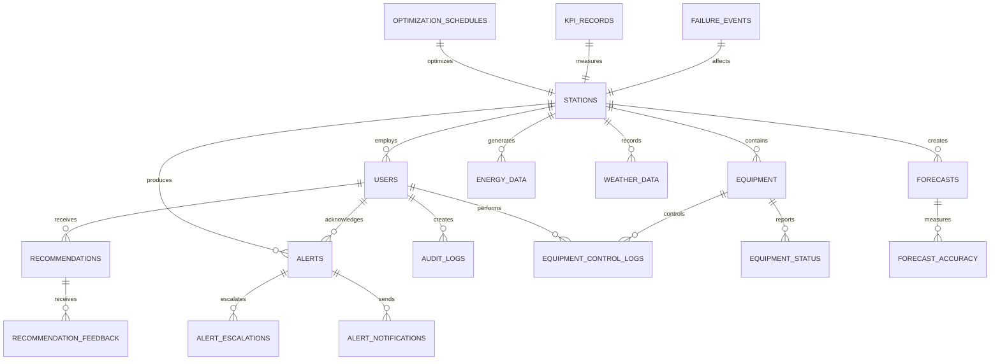
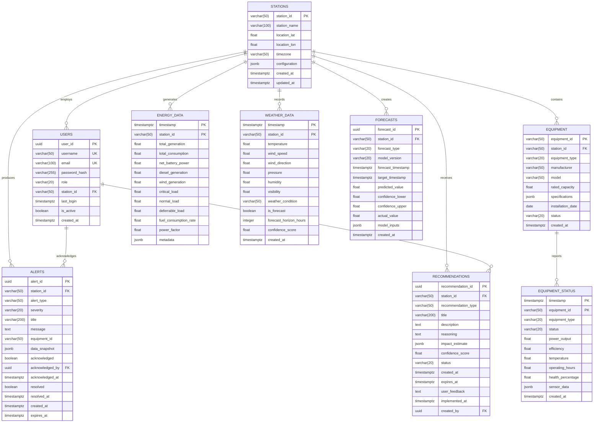

# POLAR-EMS Database Design Document

## Document Information

| Field | Value |
|-------|--------|
| **Document Title** | POLAR-EMS Database Design Document |
| **Version** | 1.0 |
| **Date** | August 23, 2026 |
| **Project** | AI-Driven Smart Energy Management System for Polar Research Stations |
| **Domain** | Polar Smart Grid Energy Management |
| **Organization** | MoES – NCPOR |
| **Related Documents** | [PRD.md](./PRD.md), [SRS.md](./SRS.md), [TECHNICAL_DESIGN.md](./TECHNICAL_DESIGN.md) |

---

## 1. Database Overview

### 1.1 Database Purpose
The POLAR-EMS database stores and manages all operational, historical, and configuration data for the AI-driven energy management system. It supports high-frequency time-series data collection, real-time analytics, forecasting model data, and user management while maintaining data integrity and performance under extreme polar conditions.

### 1.2 Database Technology Stack
- **Primary Database**: PostgreSQL 14+ with TimescaleDB extension
- **Time-Series Optimization**: TimescaleDB hypertables for high-performance time-series operations
- **Caching Layer**: Redis for session management and real-time data caching
- **Backup Strategy**: Automated daily backups with point-in-time recovery
- **Development Database**: SQLite for prototype and local development

### 1.3 Key Design Principles

#### Time-Series Optimization
High-frequency operational data (every 10 seconds) requires specialized storage and indexing strategies to maintain performance while preserving historical data for analytics and model training.

#### Data Integrity
Critical operational data must maintain ACID compliance to ensure consistency during equipment control operations and emergency situations.

#### Offline Resilience
Database design supports local operation during communication outages with automatic synchronization when connectivity resumes.

#### Scalability
Schema design accommodates growth from single-station prototypes to multi-station enterprise deployments.

---

## 2. Database Requirements

### 2.1 Data Volume Requirements
- **Real-time Data**: 100+ data points per 10-second interval
- **Historical Storage**: Minimum 2 years of high-resolution data
- **Forecast Data**: 48-hour forecasts updated every 15 minutes
- **Alert Data**: All alerts with 3+ year retention
- **User Activity**: Complete audit trail for security and compliance

### 2.2 Performance Requirements
- **Write Performance**: Handle 10+ inserts per second per station
- **Read Performance**: Dashboard queries complete in <2 seconds
- **Analytics Queries**: Historical analysis complete in <30 seconds
- **Backup Performance**: Daily backups complete in <1 hour
- **Recovery Time**: Database recovery in <15 minutes

### 2.3 Availability Requirements
- **Uptime**: 99.5% availability during normal operations
- **Offline Operation**: Continue essential functions during communication outages
- **Data Synchronization**: Automatic sync when communication resumes
- **Disaster Recovery**: Point-in-time recovery with <1 hour data loss maximum
---

## 3. Entities and Relationships

### 3.1 Core Entities Overview



### 3.2 Entity Descriptions

#### Core Operational Entities
- **STATIONS**: Research station configuration and metadata
- **EQUIPMENT**: Generator, battery, wind turbine, and monitoring equipment registry
- **USERS**: System users with role-based access control
- **ENERGY_DATA**: High-frequency time-series energy generation and consumption data
- **WEATHER_DATA**: Current weather conditions and forecasts

#### AI and Analytics Entities  
- **FORECASTS**: Load and generation predictions from AI models
- **RECOMMENDATIONS**: AI-generated operational suggestions
- **OPTIMIZATION_SCHEDULES**: Energy dispatch optimization results
- **KPI_RECORDS**: Key performance indicator calculations and trending

#### Monitoring and Safety Entities
- **ALERTS**: System alerts and notifications
- **FAILURE_EVENTS**: Equipment failures and system anomalies
- **EQUIPMENT_STATUS**: Real-time equipment health and operational status

#### Audit and Compliance Entities
- **AUDIT_LOGS**: User activity and system event logging
- **EQUIPMENT_CONTROL_LOGS**: Equipment control actions and safety audit trail
- **ALERT_NOTIFICATIONS**: Alert delivery tracking and confirmation

---

## 4. Entity Relationship Diagram


---

## 5. Table Definitions

### 5.1 Core Configuration Tables

#### STATIONS Table
```sql
CREATE TABLE stations (
    station_id VARCHAR(50) PRIMARY KEY,
    station_name VARCHAR(100) NOT NULL,
    location_lat FLOAT CHECK (location_lat >= -90 AND location_lat <= 90),
    location_lon FLOAT CHECK (location_lon >= -180 AND location_lon <= 180),
    timezone VARCHAR(50) DEFAULT 'UTC',
    configuration JSONB DEFAULT '{}',
    created_at TIMESTAMPTZ DEFAULT NOW(),
    updated_at TIMESTAMPTZ DEFAULT NOW(),
    
    CONSTRAINT valid_coordinates CHECK (
        (location_lat IS NULL AND location_lon IS NULL) OR 
        (location_lat IS NOT NULL AND location_lon IS NOT NULL)
    )
);

-- Indexes
CREATE INDEX idx_stations_location ON stations USING GIST (
    ll_to_earth(location_lat, location_lon)
) WHERE location_lat IS NOT NULL AND location_lon IS NOT NULL;

-- Triggers
CREATE TRIGGER update_stations_timestamp 
    BEFORE UPDATE ON stations 
    FOR EACH ROW EXECUTE FUNCTION update_modified_column();
```

#### USERS Table
```sql
CREATE TABLE users (
    user_id UUID PRIMARY KEY DEFAULT gen_random_uuid(),
    username VARCHAR(50) UNIQUE NOT NULL,
    email VARCHAR(100) UNIQUE NOT NULL,
    password_hash VARCHAR(255) NOT NULL,
    role VARCHAR(20) NOT NULL CHECK (role IN ('admin', 'engineer', 'operator', 'viewer')),
    station_id VARCHAR(50) REFERENCES stations(station_id) ON DELETE SET NULL,
    last_login TIMESTAMPTZ,
    failed_login_attempts INTEGER DEFAULT 0,
    locked_until TIMESTAMPTZ,
    is_active BOOLEAN DEFAULT TRUE,
    created_at TIMESTAMPTZ DEFAULT NOW(),
    updated_at TIMESTAMPTZ DEFAULT NOW(),
    
    CONSTRAINT valid_email CHECK (email ~* '^[A-Za-z0-9._%+-]+@[A-Za-z0-9.-]+\.[A-Za-z]{2,}$')
);

-- Indexes
CREATE INDEX idx_users_station ON users(station_id);
CREATE INDEX idx_users_role ON users(role);
CREATE INDEX idx_users_active ON users(is_active) WHERE is_active = TRUE;

-- Triggers
CREATE TRIGGER update_users_timestamp 
    BEFORE UPDATE ON users 
    FOR EACH ROW EXECUTE FUNCTION update_modified_column();
```

#### EQUIPMENT Table
```sql
CREATE TABLE equipment (
    equipment_id VARCHAR(50) PRIMARY KEY,
    station_id VARCHAR(50) NOT NULL REFERENCES stations(station_id) ON DELETE CASCADE,
    equipment_type VARCHAR(20) NOT NULL CHECK (
        equipment_type IN ('generator', 'battery', 'wind_turbine', 'solar_panel', 
                          'load_meter', 'weather_station', 'ups', 'inverter')
    ),
    manufacturer VARCHAR(50),
    model VARCHAR(50),
    rated_capacity FLOAT CHECK (rated_capacity > 0),
    specifications JSONB DEFAULT '{}',
    installation_date DATE,
    status VARCHAR(20) DEFAULT 'active' CHECK (
        status IN ('active', 'maintenance', 'decommissioned', 'failed')
    ),
    created_at TIMESTAMPTZ DEFAULT NOW(),
    updated_at TIMESTAMPTZ DEFAULT NOW()
);

-- Indexes
CREATE INDEX idx_equipment_station ON equipment(station_id);
CREATE INDEX idx_equipment_type ON equipment(equipment_type);
CREATE INDEX idx_equipment_status ON equipment(status);
CREATE INDEX idx_equipment_station_type ON equipment(station_id, equipment_type);
```

### 5.2 Time-Series Data Tables

#### ENERGY_DATA Table (TimescaleDB Hypertable)
```sql
CREATE TABLE energy_data (
    timestamp TIMESTAMPTZ NOT NULL,
    station_id VARCHAR(50) NOT NULL REFERENCES stations(station_id) ON DELETE CASCADE,
    total_generation FLOAT NOT NULL DEFAULT 0 CHECK (total_generation >= 0),
    total_consumption FLOAT NOT NULL DEFAULT 0 CHECK (total_consumption >= 0),
    net_battery_power FLOAT DEFAULT 0, -- Positive = charging, Negative = discharging
    diesel_generation FLOAT DEFAULT 0 CHECK (diesel_generation >= 0),
    wind_generation FLOAT DEFAULT 0 CHECK (wind_generation >= 0),
    solar_generation FLOAT DEFAULT 0 CHECK (solar_generation >= 0),
    critical_load FLOAT DEFAULT 0 CHECK (critical_load >= 0),
    normal_load FLOAT DEFAULT 0 CHECK (normal_load >= 0),
    deferrable_load FLOAT DEFAULT 0 CHECK (deferrable_load >= 0),
    fuel_consumption_rate FLOAT DEFAULT 0 CHECK (fuel_consumption_rate >= 0), -- L/hr
    power_factor FLOAT CHECK (power_factor >= 0 AND power_factor <= 1),
    system_frequency FLOAT CHECK (system_frequency > 0),
    metadata JSONB DEFAULT '{}',
    
    PRIMARY KEY (timestamp, station_id),
    
    -- Energy balance validation
    CONSTRAINT energy_balance_check CHECK (
        ABS((diesel_generation + wind_generation + solar_generation - net_battery_power) - 
            (critical_load + normal_load + deferrable_load)) < 1.0
    )
);

-- Convert to hypertable for time-series optimization
SELECT create_hypertable('energy_data', 'timestamp', chunk_time_interval => INTERVAL '1 day');

-- Indexes
CREATE INDEX idx_energy_data_station_time ON energy_data (station_id, timestamp DESC);
CREATE INDEX idx_energy_data_generation ON energy_data (total_generation);
CREATE INDEX idx_energy_data_consumption ON energy_data (total_consumption);

-- Compression policy (compress data older than 7 days)
SELECT add_compression_policy('energy_data', INTERVAL '7 days');

-- Data retention policy (keep raw data for 90 days)
SELECT add_retention_policy('energy_data', INTERVAL '90 days');
```

#### EQUIPMENT_STATUS Table (TimescaleDB Hypertable)
```sql
CREATE TABLE equipment_status (
    timestamp TIMESTAMPTZ NOT NULL,
    equipment_id VARCHAR(50) NOT NULL REFERENCES equipment(equipment_id) ON DELETE CASCADE,
    equipment_type VARCHAR(20) NOT NULL,
    status VARCHAR(20) NOT NULL CHECK (
        status IN ('running', 'stopped', 'maintenance', 'failed', 'starting', 'stopping')
    ),
    power_output FLOAT DEFAULT 0 CHECK (power_output >= 0),
    efficiency FLOAT CHECK (efficiency >= 0 AND efficiency <= 1),
    temperature FLOAT,
    operating_hours FLOAT DEFAULT 0 CHECK (operating_hours >= 0),
    health_percentage FLOAT CHECK (health_percentage >= 0 AND health_percentage <= 100),
    sensor_data JSONB DEFAULT '{}',
    created_at TIMESTAMPTZ DEFAULT NOW(),
    
    PRIMARY KEY (timestamp, equipment_id)
);

-- Convert to hypertable
SELECT create_hypertable('equipment_status', 'timestamp', chunk_time_interval => INTERVAL '1 day');

-- Indexes  
CREATE INDEX idx_equipment_status_equipment ON equipment_status (equipment_id, timestamp DESC);
CREATE INDEX idx_equipment_status_type ON equipment_status (equipment_type, timestamp DESC);
CREATE INDEX idx_equipment_status_health ON equipment_status (health_percentage, timestamp DESC) 
    WHERE health_percentage < 90;

-- Compression and retention
SELECT add_compression_policy('equipment_status', INTERVAL '7 days');
SELECT add_retention_policy('equipment_status', INTERVAL '90 days');
```

#### WEATHER_DATA Table (TimescaleDB Hypertable)
```sql
CREATE TABLE weather_data (
    timestamp TIMESTAMPTZ NOT NULL,
    station_id VARCHAR(50) NOT NULL REFERENCES stations(station_id) ON DELETE CASCADE,
    temperature FLOAT CHECK (temperature >= -100 AND temperature <= 60), -- Celsius, polar range
    wind_speed FLOAT CHECK (wind_speed >= 0 AND wind_speed <= 200), -- mph, extreme weather
    wind_direction FLOAT CHECK (wind_direction >= 0 AND wind_direction < 360), -- degrees
    pressure FLOAT CHECK (pressure > 800 AND pressure < 1200), -- hPa, atmospheric range
    humidity FLOAT CHECK (humidity >= 0 AND humidity <= 100), -- percentage
    visibility FLOAT CHECK (visibility >= 0), -- km
    weather_condition VARCHAR(50),
    precipitation_rate FLOAT DEFAULT 0 CHECK (precipitation_rate >= 0), -- mm/hr
    is_forecast BOOLEAN DEFAULT FALSE,
    forecast_horizon_hours INTEGER CHECK (forecast_horizon_hours > 0),
    confidence_score FLOAT CHECK (confidence_score >= 0 AND confidence_score <= 1),
    data_source VARCHAR(50) DEFAULT 'local_station',
    created_at TIMESTAMPTZ DEFAULT NOW(),
    
    PRIMARY KEY (timestamp, station_id, is_forecast),
    
    -- Forecast data must have horizon
    CONSTRAINT forecast_horizon_check CHECK (
        (is_forecast = FALSE) OR (is_forecast = TRUE AND forecast_horizon_hours IS NOT NULL)
    )
);

-- Convert to hypertable
SELECT create_hypertable('weather_data', 'timestamp', chunk_time_interval => INTERVAL '1 day');

-- Indexes
CREATE INDEX idx_weather_data_station ON weather_data (station_id, timestamp DESC);
CREATE INDEX idx_weather_data_forecast ON weather_data (is_forecast, timestamp DESC);
CREATE INDEX idx_weather_data_wind ON weather_data (wind_speed, timestamp DESC);

-- Compression and retention
SELECT add_compression_policy('weather_data', INTERVAL '30 days');
SELECT add_retention_policy('weather_data', INTERVAL '365 days');
```

### 5.3 AI and Analytics Tables

#### FORECASTS Table
```sql
CREATE TABLE forecasts (
    forecast_id UUID PRIMARY KEY DEFAULT gen_random_uuid(),
    station_id VARCHAR(50) NOT NULL REFERENCES stations(station_id) ON DELETE CASCADE,
    forecast_type VARCHAR(20) NOT NULL CHECK (
        forecast_type IN ('load', 'wind_power', 'solar_power', 'fuel_consumption')
    ),
    model_version VARCHAR(20) NOT NULL,
    forecast_timestamp TIMESTAMPTZ NOT NULL, -- When forecast was generated
    target_timestamp TIMESTAMPTZ NOT NULL,   -- What time is being predicted
    horizon_hours INTEGER NOT NULL CHECK (horizon_hours > 0 AND horizon_hours <= 168), -- Max 1 week
    predicted_value FLOAT NOT NULL,
    confidence_lower FLOAT,
    confidence_upper FLOAT,
    actual_value FLOAT, -- Filled in later for accuracy measurement
    model_inputs JSONB DEFAULT '{}', -- Store input features for analysis
    created_at TIMESTAMPTZ DEFAULT NOW(),
    
    -- Confidence intervals must be ordered correctly
    CONSTRAINT confidence_bounds_check CHECK (
        confidence_lower IS NULL OR confidence_upper IS NULL OR 
        confidence_lower <= predicted_value AND predicted_value <= confidence_upper
    ),
    
    -- Target must be in the future of forecast
    CONSTRAINT future_forecast_check CHECK (target_timestamp > forecast_timestamp)
);

-- Indexes
CREATE INDEX idx_forecasts_station_type ON forecasts (station_id, forecast_type);
CREATE INDEX idx_forecasts_target_time ON forecasts (target_timestamp);
CREATE INDEX idx_forecasts_accuracy ON forecasts (actual_value) WHERE actual_value IS NOT NULL;
CREATE INDEX idx_forecasts_station_target ON forecasts (station_id, target_timestamp DESC);

-- Partial index for recent forecasts
CREATE INDEX idx_forecasts_recent ON forecasts (forecast_timestamp DESC) 
    WHERE forecast_timestamp > NOW() - INTERVAL '30 days';
```

#### RECOMMENDATIONS Table
```sql
CREATE TABLE recommendations (
    recommendation_id UUID PRIMARY KEY DEFAULT gen_random_uuid(),
    station_id VARCHAR(50) NOT NULL REFERENCES stations(station_id) ON DELETE CASCADE,
    recommendation_type VARCHAR(50) NOT NULL CHECK (
        recommendation_type IN ('operational', 'maintenance', 'emergency', 'optimization', 'fuel_saving')
    ),
    title VARCHAR(200) NOT NULL,
    description TEXT NOT NULL,
    reasoning TEXT NOT NULL, -- AI explanation
    impact_estimate JSONB DEFAULT '{}', -- Fuel saved, cost, risk, etc.
    confidence_score FLOAT NOT NULL CHECK (confidence_score >= 0 AND confidence_score <= 1),
    priority INTEGER DEFAULT 5 CHECK (priority >= 1 AND priority <= 10), -- 1 = highest priority
    status VARCHAR(20) DEFAULT 'pending' CHECK (
        status IN ('pending', 'accepted', 'rejected', 'expired', 'implemented')
    ),
    created_at TIMESTAMPTZ DEFAULT NOW(),
    expires_at TIMESTAMPTZ NOT NULL,
    user_feedback TEXT,
    implemented_at TIMESTAMPTZ,
    created_by UUID REFERENCES users(user_id) ON DELETE SET NULL,
    
    -- Expiration must be in future
    CONSTRAINT future_expiration_check CHECK (expires_at > created_at)
);

-- Indexes
CREATE INDEX idx_recommendations_station ON recommendations (station_id);
CREATE INDEX idx_recommendations_status ON recommendations (status);
CREATE INDEX idx_recommendations_priority ON recommendations (priority, created_at DESC);
CREATE INDEX idx_recommendations_active ON recommendations (station_id, status, expires_at) 
    WHERE status IN ('pending', 'accepted');
```
### 5.4 Alert and Monitoring Tables

#### ALERTS Table
```sql
CREATE TABLE alerts (
    alert_id UUID PRIMARY KEY DEFAULT gen_random_uuid(),
    station_id VARCHAR(50) NOT NULL REFERENCES stations(station_id) ON DELETE CASCADE,
    alert_type VARCHAR(50) NOT NULL CHECK (
        alert_type IN ('equipment_failure', 'low_battery', 'high_fuel_consumption', 
                      'weather_warning', 'forecast_anomaly', 'system_error', 
                      'maintenance_due', 'communication_failure')
    ),
    severity VARCHAR(20) NOT NULL CHECK (severity IN ('info', 'warning', 'critical')),
    title VARCHAR(200) NOT NULL,
    message TEXT NOT NULL,
    equipment_id VARCHAR(50) REFERENCES equipment(equipment_id) ON DELETE SET NULL,
    data_snapshot JSONB DEFAULT '{}', -- System state when alert was generated
    acknowledged BOOLEAN DEFAULT FALSE,
    acknowledged_by UUID REFERENCES users(user_id) ON DELETE SET NULL,
    acknowledged_at TIMESTAMPTZ,
    resolved BOOLEAN DEFAULT FALSE,
    resolved_at TIMESTAMPTZ,
    created_at TIMESTAMPTZ DEFAULT NOW(),
    expires_at TIMESTAMPTZ, -- For temporary alerts
    
    -- Acknowledgment consistency
    CONSTRAINT acknowledgment_consistency CHECK (
        (acknowledged = FALSE AND acknowledged_by IS NULL AND acknowledged_at IS NULL) OR
        (acknowledged = TRUE AND acknowledged_by IS NOT NULL AND acknowledged_at IS NOT NULL)
    ),
    
    -- Resolution must come after acknowledgment (for critical alerts)
    CONSTRAINT resolution_order CHECK (
        resolved = FALSE OR acknowledged = TRUE OR severity != 'critical'
    )
);

-- Indexes
CREATE INDEX idx_alerts_station ON alerts (station_id);
CREATE INDEX idx_alerts_severity ON alerts (severity, created_at DESC);
CREATE INDEX idx_alerts_active ON alerts (station_id, resolved, created_at DESC) 
    WHERE resolved = FALSE;
CREATE INDEX idx_alerts_equipment ON alerts (equipment_id) WHERE equipment_id IS NOT NULL;

-- Partial indexes for performance
CREATE INDEX idx_alerts_critical_unresolved ON alerts (station_id, created_at DESC) 
    WHERE severity = 'critical' AND resolved = FALSE;
```

#### ALERT_ESCALATIONS Table
```sql
CREATE TABLE alert_escalations (
    escalation_id UUID PRIMARY KEY DEFAULT gen_random_uuid(),
    alert_id UUID NOT NULL REFERENCES alerts(alert_id) ON DELETE CASCADE,
    escalation_level INTEGER NOT NULL CHECK (escalation_level >= 1),
    escalated_to UUID REFERENCES users(user_id) ON DELETE SET NULL,
    escalation_method VARCHAR(20) CHECK (
        escalation_method IN ('email', 'sms', 'dashboard', 'audio_alarm')
    ),
    escalated_at TIMESTAMPTZ DEFAULT NOW(),
    acknowledged_at TIMESTAMPTZ,
    
    UNIQUE(alert_id, escalation_level)
);

-- Indexes
CREATE INDEX idx_escalations_alert ON alert_escalations (alert_id);
CREATE INDEX idx_escalations_user ON alert_escalations (escalated_to);
CREATE INDEX idx_escalations_pending ON alert_escalations (escalated_at) 
    WHERE acknowledged_at IS NULL;
```

#### FAILURE_EVENTS Table
```sql
CREATE TABLE failure_events (
    event_id UUID PRIMARY KEY DEFAULT gen_random_uuid(),
    station_id VARCHAR(50) NOT NULL REFERENCES stations(station_id) ON DELETE CASCADE,
    equipment_id VARCHAR(50) REFERENCES equipment(equipment_id) ON DELETE SET NULL,
    failure_type VARCHAR(50) NOT NULL CHECK (
        failure_type IN ('power_failure', 'communication_failure', 'mechanical_failure',
                        'sensor_failure', 'overheating', 'fuel_system_failure',
                        'battery_failure', 'weather_damage')
    ),
    severity VARCHAR(20) NOT NULL CHECK (severity IN ('low', 'medium', 'high', 'critical')),
    detected_at TIMESTAMPTZ NOT NULL,
    detected_by VARCHAR(50) CHECK (
        detected_by IN ('automatic', 'user_report', 'maintenance_check', 'ai_analysis')
    ),
    description TEXT NOT NULL,
    system_impact TEXT,
    response_actions JSONB DEFAULT '[]', -- Array of response steps taken
    recovery_time INTERVAL, -- Time to restore normal operation
    root_cause TEXT,
    preventive_actions TEXT,
    resolved_at TIMESTAMPTZ,
    created_at TIMESTAMPTZ DEFAULT NOW(),
    
    -- Recovery time only valid if resolved
    CONSTRAINT recovery_time_check CHECK (
        recovery_time IS NULL OR resolved_at IS NOT NULL
    )
);

-- Indexes
CREATE INDEX idx_failure_events_station ON failure_events (station_id);
CREATE INDEX idx_failure_events_equipment ON failure_events (equipment_id) 
    WHERE equipment_id IS NOT NULL;
CREATE INDEX idx_failure_events_type_severity ON failure_events (failure_type, severity);
CREATE INDEX idx_failure_events_unresolved ON failure_events (detected_at DESC) 
    WHERE resolved_at IS NULL;
```

### 5.5 Optimization and Control Tables

#### OPTIMIZATION_SCHEDULES Table
```sql
CREATE TABLE optimization_schedules (
    schedule_id UUID PRIMARY KEY DEFAULT gen_random_uuid(),
    station_id VARCHAR(50) NOT NULL REFERENCES stations(station_id) ON DELETE CASCADE,
    optimization_timestamp TIMESTAMPTZ NOT NULL, -- When optimization was run
    schedule_start TIMESTAMPTZ NOT NULL, -- Start of optimization horizon
    schedule_end TIMESTAMPTZ NOT NULL, -- End of optimization horizon
    objective_value FLOAT, -- Optimization objective (cost, fuel consumption, etc.)
    optimization_status VARCHAR(20) DEFAULT 'optimal' CHECK (
        optimization_status IN ('optimal', 'feasible', 'infeasible', 'unbounded', 'error')
    ),
    generator_schedule JSONB NOT NULL DEFAULT '[]', -- Array of generator setpoints
    battery_schedule JSONB NOT NULL DEFAULT '[]', -- Array of battery charge/discharge
    load_schedule JSONB DEFAULT '[]', -- Deferrable load scheduling
    constraints_violated JSONB DEFAULT '[]', -- Any constraint violations
    solver_time_ms INTEGER, -- Time taken to solve optimization
    created_at TIMESTAMPTZ DEFAULT NOW(),
    
    -- Schedule must be in future or present
    CONSTRAINT schedule_timing_check CHECK (schedule_start >= optimization_timestamp),
    CONSTRAINT schedule_order_check CHECK (schedule_end > schedule_start)
);

-- Indexes
CREATE INDEX idx_optimization_station ON optimization_schedules (station_id);
CREATE INDEX idx_optimization_schedule_time ON optimization_schedules (schedule_start);
CREATE INDEX idx_optimization_status ON optimization_schedules (optimization_status);
CREATE INDEX idx_optimization_recent ON optimization_schedules (optimization_timestamp DESC);
```

#### KPI_RECORDS Table
```sql
CREATE TABLE kpi_records (
    kpi_id UUID PRIMARY KEY DEFAULT gen_random_uuid(),
    station_id VARCHAR(50) NOT NULL REFERENCES stations(station_id) ON DELETE CASCADE,
    measurement_date DATE NOT NULL,
    kpi_type VARCHAR(50) NOT NULL CHECK (
        kpi_type IN ('fuel_consumption', 'renewable_percentage', 'system_efficiency',
                    'cost_savings', 'uptime_percentage', 'carbon_emissions',
                    'battery_cycles', 'generator_runtime')
    ),
    value FLOAT NOT NULL,
    baseline_value FLOAT, -- Comparison baseline
    target_value FLOAT, -- Performance target
    unit VARCHAR(20) NOT NULL, -- L, %, kWh, $, hours, etc.
    calculation_method TEXT, -- How the KPI was calculated
    data_quality FLOAT CHECK (data_quality >= 0 AND data_quality <= 1), -- Data completeness
    created_at TIMESTAMPTZ DEFAULT NOW(),
    
    UNIQUE(station_id, measurement_date, kpi_type)
);

-- Indexes
CREATE INDEX idx_kpi_records_station_date ON kpi_records (station_id, measurement_date DESC);
CREATE INDEX idx_kpi_records_type ON kpi_records (kpi_type, measurement_date DESC);
CREATE INDEX idx_kpi_records_recent ON kpi_records (measurement_date DESC) 
    WHERE measurement_date > CURRENT_DATE - INTERVAL '30 days';
```

### 5.6 Audit and Security Tables

#### AUDIT_LOGS Table
```sql
CREATE TABLE audit_logs (
    log_id UUID PRIMARY KEY DEFAULT gen_random_uuid(),
    user_id UUID REFERENCES users(user_id) ON DELETE SET NULL,
    session_id VARCHAR(255), -- Session identifier
    action VARCHAR(100) NOT NULL, -- login, logout, data_export, config_change, etc.
    resource VARCHAR(100), -- What was accessed or modified
    resource_id VARCHAR(100), -- Specific resource identifier
    ip_address INET,
    user_agent TEXT,
    request_method VARCHAR(10), -- HTTP method
    request_path VARCHAR(500), -- API endpoint or page
    response_status INTEGER, -- HTTP status code
    details JSONB DEFAULT '{}', -- Additional context
    timestamp TIMESTAMPTZ DEFAULT NOW(),
    
    -- Method should be valid HTTP method
    CONSTRAINT valid_http_method CHECK (
        request_method IS NULL OR 
        request_method IN ('GET', 'POST', 'PUT', 'DELETE', 'PATCH', 'OPTIONS', 'HEAD')
    )
);

-- Indexes
CREATE INDEX idx_audit_logs_user ON audit_logs (user_id, timestamp DESC);
CREATE INDEX idx_audit_logs_action ON audit_logs (action, timestamp DESC);
CREATE INDEX idx_audit_logs_resource ON audit_logs (resource, timestamp DESC);
CREATE INDEX idx_audit_logs_session ON audit_logs (session_id) WHERE session_id IS NOT NULL;
CREATE INDEX idx_audit_logs_ip ON audit_logs (ip_address) WHERE ip_address IS NOT NULL;

-- Partitioning for large audit data
CREATE TABLE audit_logs_y2026m08 PARTITION OF audit_logs 
    FOR VALUES FROM ('2026-08-01') TO ('2026-09-01');
```

#### EQUIPMENT_CONTROL_LOGS Table
```sql
CREATE TABLE equipment_control_logs (
    control_id UUID PRIMARY KEY DEFAULT gen_random_uuid(),
    user_id UUID REFERENCES users(user_id) ON DELETE SET NULL,
    equipment_id VARCHAR(50) NOT NULL REFERENCES equipment(equipment_id) ON DELETE CASCADE,
    action VARCHAR(50) NOT NULL CHECK (
        action IN ('start', 'stop', 'restart', 'emergency_stop', 'set_power', 
                  'set_mode', 'maintenance_mode', 'reset', 'calibrate')
    ),
    old_state JSONB, -- Equipment state before action
    new_state JSONB, -- Equipment state after action
    command_parameters JSONB DEFAULT '{}', -- Parameters sent with command
    execution_result VARCHAR(20) DEFAULT 'pending' CHECK (
        execution_result IN ('pending', 'success', 'failed', 'timeout', 'rejected')
    ),
    result_message TEXT, -- Success/error message
    safety_override BOOLEAN DEFAULT FALSE, -- Whether safety systems were overridden
    authorization_level VARCHAR(20), -- Required authorization level
    timestamp TIMESTAMPTZ DEFAULT NOW(),
    completed_at TIMESTAMPTZ
);

-- Indexes
CREATE INDEX idx_control_logs_user ON equipment_control_logs (user_id, timestamp DESC);
CREATE INDEX idx_control_logs_equipment ON equipment_control_logs (equipment_id, timestamp DESC);
CREATE INDEX idx_control_logs_action ON equipment_control_logs (action, timestamp DESC);
CREATE INDEX idx_control_logs_safety ON equipment_control_logs (safety_override, timestamp DESC) 
    WHERE safety_override = TRUE;
```

---

## 6. Relationships and Constraints

### 6.1 Primary Key Strategies

#### Single Column Primary Keys
- **UUID Primary Keys**: Used for entities with no natural key (alerts, recommendations, logs)
- **String Primary Keys**: Used for equipment and stations with meaningful identifiers
- **Composite Primary Keys**: Used for time-series data (timestamp + entity_id)

#### Time-Series Composite Keys
```sql
-- Energy data partitioned by time and station
PRIMARY KEY (timestamp, station_id)

-- Equipment status partitioned by time and equipment
PRIMARY KEY (timestamp, equipment_id)

-- Weather data includes forecast flag to separate actual vs predicted
PRIMARY KEY (timestamp, station_id, is_forecast)
```

### 6.2 Foreign Key Relationships

#### Cascading Delete Rules
```sql
-- Station deletion cascades to all related data
REFERENCES stations(station_id) ON DELETE CASCADE

-- User deletion preserves audit trail but nullifies references
REFERENCES users(user_id) ON DELETE SET NULL

-- Equipment deletion cascades to status but preserves control logs
REFERENCES equipment(equipment_id) ON DELETE CASCADE -- for equipment_status
REFERENCES equipment(equipment_id) ON DELETE SET NULL -- for control_logs
```

### 6.3 Data Integrity Constraints

#### Business Rule Constraints
```sql
-- Energy balance validation
CONSTRAINT energy_balance_check CHECK (
    ABS((diesel_generation + wind_generation + solar_generation - net_battery_power) - 
        (critical_load + normal_load + deferrable_load)) < 1.0
)

-- Temperature ranges for polar conditions
CONSTRAINT polar_temperature_range CHECK (
    temperature >= -100 AND temperature <= 60
)

-- Wind speed physical limits
CONSTRAINT realistic_wind_speed CHECK (
    wind_speed >= 0 AND wind_speed <= 200
)

-- Future timestamp validation
CONSTRAINT future_forecast_check CHECK (
    target_timestamp > forecast_timestamp
)
```
---

## 7. Indexes and Performance Optimization

### 7.1 Time-Series Index Strategy

#### Hypertable Partitioning
```sql
-- Automatic time-based partitioning
SELECT create_hypertable('energy_data', 'timestamp', chunk_time_interval => INTERVAL '1 day');
SELECT create_hypertable('equipment_status', 'timestamp', chunk_time_interval => INTERVAL '1 day');
SELECT create_hypertable('weather_data', 'timestamp', chunk_time_interval => INTERVAL '1 day');

-- Space partitioning by station for multi-station deployments
SELECT add_dimension('energy_data', 'station_id', number_partitions => 4);
```

#### Composite Indexes for Time-Series Queries
```sql
-- Station + time descending for recent data queries
CREATE INDEX idx_energy_data_station_time ON energy_data (station_id, timestamp DESC);

-- Equipment + time for status monitoring
CREATE INDEX idx_equipment_status_equipment_time ON equipment_status (equipment_id, timestamp DESC);

-- Weather conditions for forecasting
CREATE INDEX idx_weather_data_conditions ON weather_data (station_id, timestamp DESC, wind_speed, temperature);
```

### 7.2 Analytical Query Indexes

#### Alert Management Indexes
```sql
-- Active alerts by severity (most common dashboard query)
CREATE INDEX idx_alerts_active_severity ON alerts (station_id, severity, created_at DESC) 
    WHERE resolved = FALSE;

-- Equipment-specific alerts
CREATE INDEX idx_alerts_equipment_active ON alerts (equipment_id, created_at DESC) 
    WHERE equipment_id IS NOT NULL AND resolved = FALSE;
```

#### Forecasting and Analytics Indexes
```sql
-- Forecast accuracy analysis
CREATE INDEX idx_forecasts_accuracy_analysis ON forecasts (
    station_id, forecast_type, target_timestamp DESC, actual_value
) WHERE actual_value IS NOT NULL;

-- KPI trending queries
CREATE INDEX idx_kpi_trending ON kpi_records (station_id, kpi_type, measurement_date DESC);

-- Recent recommendations
CREATE INDEX idx_recommendations_recent ON recommendations (station_id, created_at DESC) 
    WHERE status IN ('pending', 'accepted') AND expires_at > NOW();
```

### 7.3 Query Optimization Techniques

#### Materialized Views for Complex Analytics
```sql
-- Daily energy summary view
CREATE MATERIALIZED VIEW daily_energy_summary AS
SELECT 
    date_trunc('day', timestamp) AS date,
    station_id,
    AVG(total_generation) AS avg_generation,
    AVG(total_consumption) AS avg_consumption,
    SUM(fuel_consumption_rate) AS total_fuel_consumed,
    AVG(wind_generation / NULLIF(total_generation, 0)) * 100 AS renewable_percentage,
    COUNT(*) AS data_points
FROM energy_data
WHERE timestamp >= CURRENT_DATE - INTERVAL '365 days'
GROUP BY date_trunc('day', timestamp), station_id
ORDER BY date DESC, station_id;

-- Refresh policy
CREATE UNIQUE INDEX ON daily_energy_summary (date, station_id);
```

#### Partial Indexes for Sparse Data
```sql
-- Index only failed equipment
CREATE INDEX idx_equipment_status_failed ON equipment_status (equipment_id, timestamp DESC) 
    WHERE status IN ('failed', 'maintenance');

-- Index only critical alerts
CREATE INDEX idx_alerts_critical ON alerts (station_id, created_at DESC) 
    WHERE severity = 'critical';

-- Index only recent forecasts
CREATE INDEX idx_forecasts_recent ON forecasts (station_id, target_timestamp) 
    WHERE forecast_timestamp > NOW() - INTERVAL '48 hours';
```

---

## 8. Sample Data Records

### 8.1 Configuration Data Examples

#### Sample Station Record
```sql
INSERT INTO stations (station_id, station_name, location_lat, location_lon, timezone, configuration) 
VALUES (
    'ANTARCTIC_BASE_01',
    'McMurdo Research Station',
    -77.8419,
    166.6863,
    'Antarctica/McMurdo',
    '{
        "capacity": {
            "max_generation": 150,
            "max_load": 120,
            "battery_capacity": 500
        },
        "equipment": {
            "generators": 3,
            "wind_turbines": 2,
            "battery_banks": 2
        },
        "operational_limits": {
            "min_temperature": -50,
            "max_wind_speed": 100
        }
    }'
);
```

#### Sample Equipment Records
```sql
INSERT INTO equipment (equipment_id, station_id, equipment_type, manufacturer, model, rated_capacity, specifications) VALUES
('GEN_001', 'ANTARCTIC_BASE_01', 'generator', 'Caterpillar', 'C7.1', 75.0, 
 '{"fuel_type": "diesel", "efficiency": 0.35, "min_load": 10, "max_load": 75, "startup_time_min": 2}'),

('BATT_001', 'ANTARCTIC_BASE_01', 'battery', 'Tesla', 'Megapack', 250.0, 
 '{"chemistry": "LiFePO4", "voltage": 480, "capacity_kwh": 500, "charge_efficiency": 0.95}'),

('WIND_001', 'ANTARCTIC_BASE_01', 'wind_turbine', 'Vestas', 'V27', 50.0, 
 '{"rotor_diameter": 27, "cut_in_speed": 3.5, "rated_wind_speed": 15, "cut_out_speed": 25}');
```

### 8.2 Time-Series Data Examples

#### Sample Energy Data
```sql
INSERT INTO energy_data (
    timestamp, station_id, total_generation, total_consumption, 
    diesel_generation, wind_generation, net_battery_power,
    critical_load, normal_load, deferrable_load, fuel_consumption_rate
) VALUES
('2026-08-23 14:30:00+00', 'ANTARCTIC_BASE_01', 85.5, 78.2, 45.2, 32.8, 7.5, 35.4, 28.7, 14.1, 12.8),
('2026-08-23 14:30:10+00', 'ANTARCTIC_BASE_01', 87.1, 79.5, 46.8, 33.1, 7.2, 35.8, 29.2, 14.5, 13.2),
('2026-08-23 14:30:20+00', 'ANTARCTIC_BASE_01', 84.3, 77.8, 44.5, 31.9, 7.9, 35.1, 28.4, 14.3, 12.5);
```

#### Sample Weather Data
```sql
INSERT INTO weather_data (
    timestamp, station_id, temperature, wind_speed, wind_direction, 
    pressure, humidity, visibility, weather_condition
) VALUES
('2026-08-23 14:30:00+00', 'ANTARCTIC_BASE_01', -28.5, 22.3, 285, 995.2, 68, 15.2, 'partly_cloudy'),
('2026-08-23 15:00:00+00', 'ANTARCTIC_BASE_01', -28.3, 24.1, 290, 994.8, 70, 12.8, 'cloudy', TRUE, 1, 0.85);
```

### 8.3 Alert and Event Examples

#### Sample Alert Record
```sql
INSERT INTO alerts (
    station_id, alert_type, severity, title, message, 
    equipment_id, data_snapshot
) VALUES (
    'ANTARCTIC_BASE_01',
    'equipment_failure', 
    'critical',
    'Generator GEN_001 Temperature Critical',
    'Engine temperature has reached 98°C, exceeding safe operating limits. Immediate attention required.',
    'GEN_001',
    '{"temperature": 98.2, "power_output": 45.2, "fuel_flow": 12.8, "timestamp": "2026-08-23T14:30:00Z"}'
);
```

#### Sample Recommendation Record
```sql
INSERT INTO recommendations (
    station_id, recommendation_type, title, description, reasoning,
    impact_estimate, confidence_score
) VALUES (
    'ANTARCTIC_BASE_01',
    'fuel_saving',
    'Increase Battery Charging During High Wind Period',
    'Charge battery bank to 95% capacity during predicted high wind period (16:00-20:00) to maximize fuel savings overnight.',
    'Weather forecast shows sustained winds of 25+ mph for next 4 hours. Wind generation will exceed current load by 15kW average. Battery SOC currently at 65%. Charging now will reduce diesel consumption by estimated 18L during low wind period tonight (22:00-06:00).',
    '{"fuel_saved_liters": 18, "cost_savings_usd": 72, "co2_reduction_kg": 47, "implementation_effort": "automatic"}',
    0.87
);
```

---

## 9. Data Retention and Archival

### 9.1 Retention Policies

#### Time-Series Data Retention
```sql
-- Raw energy data: 90 days
SELECT add_retention_policy('energy_data', INTERVAL '90 days');

-- Equipment status: 90 days  
SELECT add_retention_policy('equipment_status', INTERVAL '90 days');

-- Weather data: 1 year
SELECT add_retention_policy('weather_data', INTERVAL '365 days');

-- Compressed historical summaries: 7 years
SELECT add_retention_policy('daily_energy_summary', INTERVAL '7 years');
```

#### Application Data Retention
```sql
-- Forecasts: Keep for accuracy analysis (1 year)
DELETE FROM forecasts WHERE created_at < NOW() - INTERVAL '1 year';

-- Resolved alerts: 3 years
DELETE FROM alerts WHERE resolved = TRUE AND resolved_at < NOW() - INTERVAL '3 years';

-- Audit logs: 7 years (compliance requirement)
DELETE FROM audit_logs WHERE timestamp < NOW() - INTERVAL '7 years';

-- Implemented recommendations: 2 years
DELETE FROM recommendations 
WHERE status = 'implemented' AND implemented_at < NOW() - INTERVAL '2 years';
```

### 9.2 Data Compression Strategies

#### TimescaleDB Compression
```sql
-- Enable compression after 7 days
SELECT add_compression_policy('energy_data', INTERVAL '7 days');
SELECT add_compression_policy('equipment_status', INTERVAL '7 days');
SELECT add_compression_policy('weather_data', INTERVAL '30 days');

-- Custom compression settings for high-frequency data
ALTER TABLE energy_data SET (
    timescaledb.compress,
    timescaledb.compress_segmentby = 'station_id',
    timescaledb.compress_orderby = 'timestamp DESC'
);
```

#### Archive Table Strategy
```sql
-- Create archive tables for long-term storage
CREATE TABLE energy_data_archive (LIKE energy_data);
CREATE TABLE equipment_status_archive (LIKE equipment_status);

-- Archive procedure
CREATE OR REPLACE FUNCTION archive_old_data()
RETURNS void AS $$
BEGIN
    -- Move data older than retention period to archive
    WITH archived_data AS (
        DELETE FROM energy_data 
        WHERE timestamp < NOW() - INTERVAL '90 days'
        RETURNING *
    )
    INSERT INTO energy_data_archive SELECT * FROM archived_data;
END;
$$ LANGUAGE plpgsql;

-- Schedule archive job
SELECT cron.schedule('archive-energy-data', '0 2 * * *', 'SELECT archive_old_data();');
```

### 9.3 Backup Strategy

#### Automated Backup Configuration
```sql
-- Full database backup daily
pg_dump --host=localhost --port=5432 --username=polar --format=custom 
        --no-password --verbose --file="/backups/polar_ems_full_$(date +%Y%m%d).backup" 
        --dbname=polar_ems

-- Incremental WAL archiving
archive_mode = on
archive_command = 'cp %p /backup/wal_archive/%f'
```

#### Point-in-Time Recovery
```sql
-- Create base backup
SELECT pg_start_backup('daily_backup');
-- Copy data directory
-- SELECT pg_stop_backup();

-- Recovery configuration
restore_command = 'cp /backup/wal_archive/%f %p'
recovery_target_time = '2026-08-23 14:30:00'
```

---

## 10. Database Security

### 10.1 Access Control

#### Role-Based Database Security
```sql
-- Create application roles
CREATE ROLE polar_admin;
CREATE ROLE polar_engineer; 
CREATE ROLE polar_operator;
CREATE ROLE polar_viewer;

-- Admin role: Full access
GRANT ALL PRIVILEGES ON ALL TABLES IN SCHEMA public TO polar_admin;
GRANT ALL PRIVILEGES ON ALL SEQUENCES IN SCHEMA public TO polar_admin;

-- Engineer role: Read/write operational data, limited config access
GRANT SELECT, INSERT, UPDATE ON energy_data TO polar_engineer;
GRANT SELECT, INSERT, UPDATE ON equipment_status TO polar_engineer;
GRANT SELECT, INSERT, UPDATE ON alerts TO polar_engineer;
GRANT SELECT ON stations, equipment TO polar_engineer;

-- Operator role: Read operational data, insert monitoring data
GRANT SELECT ON ALL TABLES IN SCHEMA public TO polar_operator;
GRANT INSERT ON energy_data, equipment_status, weather_data TO polar_operator;

-- Viewer role: Read-only access to non-sensitive data
GRANT SELECT ON energy_data, weather_data, forecasts TO polar_viewer;
GRANT SELECT ON alerts WHERE severity != 'critical' TO polar_viewer;
```

#### Row-Level Security
```sql
-- Enable RLS for multi-station deployments
ALTER TABLE energy_data ENABLE ROW LEVEL SECURITY;
ALTER TABLE alerts ENABLE ROW LEVEL SECURITY;

-- Users can only access data from their assigned station
CREATE POLICY station_access_policy ON energy_data
    FOR ALL TO polar_engineer, polar_operator, polar_viewer
    USING (station_id = current_setting('app.current_station'));
```

### 10.2 Data Protection

#### Sensitive Data Encryption
```sql
-- Extension for encryption functions
CREATE EXTENSION IF NOT EXISTS pgcrypto;

-- Encrypted fields for sensitive data
ALTER TABLE users ADD COLUMN encrypted_notes TEXT;

-- Encryption functions
CREATE OR REPLACE FUNCTION encrypt_sensitive(data TEXT, key TEXT)
RETURNS TEXT AS $$
BEGIN
    RETURN encode(pgp_sym_encrypt(data, key), 'base64');
END;
$$ LANGUAGE plpgsql;

CREATE OR REPLACE FUNCTION decrypt_sensitive(encrypted_data TEXT, key TEXT)
RETURNS TEXT AS $$
BEGIN
    RETURN pgp_sym_decrypt(decode(encrypted_data, 'base64'), key);
END;
$$ LANGUAGE plpgsql;
```

#### Audit Trail Security
```sql
-- Protect audit logs from modification
CREATE POLICY audit_insert_only ON audit_logs FOR INSERT WITH CHECK (true);
CREATE POLICY audit_no_update ON audit_logs FOR UPDATE USING (false);
CREATE POLICY audit_no_delete ON audit_logs FOR DELETE USING (false);
```

---

*This Database Design Document provides the comprehensive foundation for POLAR-EMS data management, ensuring scalability, performance, and reliability while maintaining data integrity and security for polar research station operations.*