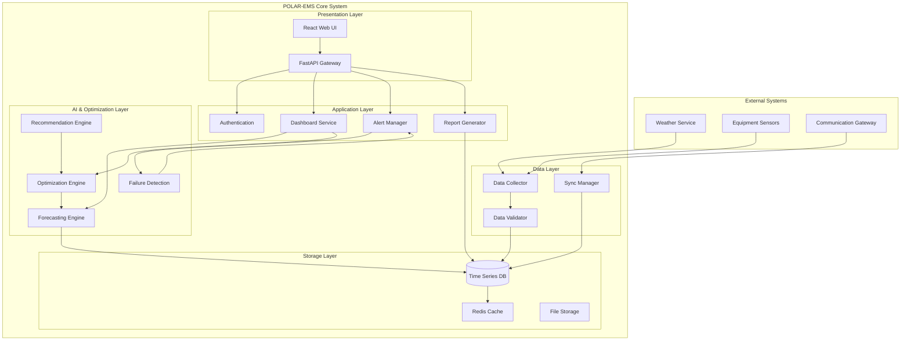
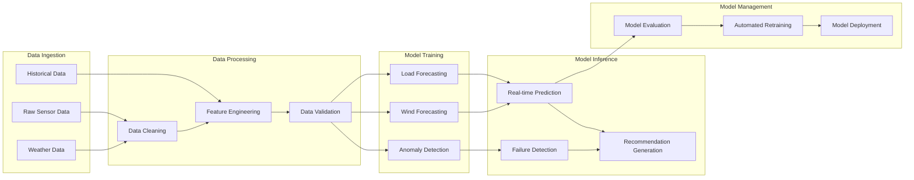
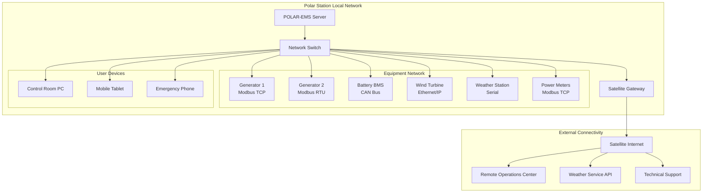

# POLAR-EMS Technical Design Document

## Document Information

| Field | Value |
|-------|--------|
| **Document Title** | POLAR-EMS Technical Design Document |
| **Version** | 1.0 |
| **Date** | August 23, 2026 |
| **Project** | AI-Driven Smart Energy Management System for Polar Research Stations |
| **Domain** | Polar Smart Grid Energy Management |
| **Organization** | MoES – NCPOR |
| **Related Documents** | [PRD.md](./PRD.md), [SRS.md](./SRS.md), [UI_UX_DESIGN.md](./UI_UX_DESIGN.md) |

---

## 1. Technical Overview

### 1.1 System Purpose
POLAR-EMS is an AI-powered energy management system that provides autonomous optimization and control for polar research station microgrids. The system integrates forecasting, optimization, and control capabilities to maximize renewable energy utilization while ensuring critical load protection and minimizing fuel consumption.

### 1.2 Core Architecture Principles

#### Offline-First Design
The system operates autonomously during communication outages, maintaining all critical functions locally with periodic synchronization when connectivity is available.

#### Modular Architecture
Loosely coupled components allow for independent development, testing, and deployment while maintaining system reliability and scalability.

#### AI-Driven Intelligence
Machine learning models provide forecasting capabilities, while optimization algorithms ensure efficient energy dispatch decisions.

#### Safety-First Approach
All automated decisions include safety margins and manual override capabilities, with fail-safe defaults that protect critical loads.

### 1.3 Technology Stack Overview

#### Frontend Technology (Proposed Implementation)
- **React 18**: Component-based UI framework with hooks and concurrent features
- **Vite**: Fast build tool and development server
- **Tailwind CSS**: Utility-first CSS framework for rapid UI development
- **Recharts**: React charting library for data visualization
- **Framer Motion**: Animation library for smooth UI interactions
- **Lucide React**: Consistent icon system

#### Backend Technology (Proposed Implementation)
- **Python 3.11+**: Primary backend language
- **FastAPI**: High-performance web framework with automatic API documentation
- **SQLAlchemy**: Database ORM with support for multiple database engines
- **Pydantic**: Data validation and serialization
- **APScheduler**: Advanced Python Scheduler for background tasks

#### AI/ML Technology (Proposed Implementation)
- **Python**: Primary language for ML pipeline
- **Pandas**: Data manipulation and analysis
- **NumPy**: Numerical computing foundation
- **Scikit-learn**: Machine learning algorithms and tools
- **XGBoost**: Gradient boosting for time series forecasting
- **Optuna**: Hyperparameter optimization

#### Optimization Technology (Proposed Implementation)
- **PuLP**: Linear programming library for optimization problems
- **OR-Tools**: Google's optimization tools for complex scheduling
- **NumPy**: Mathematical operations and matrix calculations

#### Database Technology (Proposed Implementation)
- **SQLite**: Lightweight database for prototype and development
- **PostgreSQL**: Production database with time-series capabilities
- **TimescaleDB Extension**: Time-series optimization for PostgreSQL
---

## 2. System Architecture

### 2.1 High-Level Architecture



### 2.2 Layered Architecture Description

#### Layer 1: Presentation & Interface Layer
- **Web UI**: React-based responsive interface for all user interactions
- **API Gateway**: FastAPI-based REST API providing all backend functionality
- **Authentication**: JWT-based session management with role-based access control

#### Layer 2: Application Services Layer
- **Dashboard Service**: Real-time system status aggregation and presentation
- **Alert Manager**: Intelligent alert generation, escalation, and notification
- **Report Generator**: Automated report creation and delivery
- **Configuration Manager**: System settings and parameter management

#### Layer 3: AI & Optimization Layer
- **Forecasting Engine**: Machine learning models for load and generation prediction
- **Optimization Engine**: Mathematical optimization for energy dispatch decisions
- **Recommendation Engine**: AI-powered operational suggestion generation
- **Failure Detection**: Anomaly detection and automated response coordination

#### Layer 4: Data Management Layer
- **Data Collector**: Real-time data acquisition from equipment and weather sources
- **Data Validator**: Quality checking, cleaning, and preprocessing
- **Sync Manager**: Communication handling and offline/online synchronization

#### Layer 5: Storage Layer
- **Time Series Database**: High-performance storage for operational and historical data
- **Cache Layer**: Redis for session management and real-time data caching
- **File Storage**: Configuration files, logs, and exported data
---

## 3. Frontend Architecture

### 3.1 React Application Structure

```
src/
├── components/           # Reusable UI components
│   ├── charts/          # Chart components (Recharts)
│   ├── forms/           # Form components and validation
│   ├── layout/          # Layout components (header, sidebar)
│   ├── ui/              # Basic UI elements (buttons, cards)
│   └── widgets/         # Complex composite components
├── pages/               # Page-level components
│   ├── Dashboard/       # Mission control dashboard
│   ├── Forecast/        # AI forecasting interface
│   ├── Analytics/       # Performance analytics
│   ├── Settings/        # System configuration
│   └── Auth/            # Authentication pages
├── hooks/               # Custom React hooks
│   ├── useAuth.js       # Authentication state management
│   ├── useWebSocket.js  # Real-time data connection
│   ├── useLocalStorage.js # Offline data persistence
│   └── useApi.js        # API integration hooks
├── services/            # External service integration
│   ├── api.js           # REST API client
│   ├── websocket.js     # WebSocket client for real-time updates
│   ├── auth.js          # Authentication service
│   └── offline.js       # Offline data management
├── stores/              # State management (Zustand)
│   ├── authStore.js     # User authentication state
│   ├── systemStore.js   # System status state
│   ├── alertStore.js    # Alert management state
│   └── settingsStore.js # User preferences and settings
├── utils/               # Utility functions
│   ├── calculations.js  # Energy calculations and conversions
│   ├── formatters.js    # Data formatting utilities
│   ├── validators.js    # Input validation functions
│   └── constants.js     # Application constants
└── styles/              # Styling and theming
    ├── globals.css      # Global styles and CSS variables
    ├── components.css   # Component-specific styles
    └── themes.js        # Theme configuration (dark/light)
```

### 3.2 State Management Strategy

#### Zustand for Global State
Lightweight state management for:
- User authentication and session data
- Real-time system status and metrics
- Alert management and notifications
- User preferences and settings

#### React Query for Server State
Efficient server state management with:
- Automatic caching and background refetching
- Optimistic updates for better user experience
- Error handling and retry logic
- Offline query caching

#### Local Storage for Persistence
Offline-first capabilities through:
- Critical system data caching
- User preference persistence
- Alert history storage
- Draft configurations

### 3.3 Real-Time Data Handling

#### WebSocket Integration
```javascript
// useWebSocket.js - Custom hook for real-time updates
export const useWebSocket = (endpoint) => {
  const [data, setData] = useState(null);
  const [connected, setConnected] = useState(false);
  
  useEffect(() => {
    const ws = new WebSocket(`ws://localhost:8000${endpoint}`);
    
    ws.onopen = () => setConnected(true);
    ws.onmessage = (event) => setData(JSON.parse(event.data));
    ws.onclose = () => setConnected(false);
    
    return () => ws.close();
  }, [endpoint]);
  
  return { data, connected };
};
```

#### Offline Data Synchronization
- Service worker for background synchronization
- IndexedDB for large offline data storage
- Conflict resolution for concurrent modifications
- Priority-based sync queue management
---

## 4. Backend Architecture

### 4.1 FastAPI Application Structure

```
backend/
├── app/
│   ├── api/                 # API route definitions
│   │   ├── v1/             # API version 1 routes
│   │   │   ├── auth.py     # Authentication endpoints
│   │   │   ├── dashboard.py # Dashboard data endpoints
│   │   │   ├── forecast.py  # Forecasting endpoints
│   │   │   ├── optimization.py # Optimization endpoints
│   │   │   ├── alerts.py    # Alert management endpoints
│   │   │   └── analytics.py # Analytics endpoints
│   │   └── deps.py         # API dependencies (auth, db)
│   ├── core/               # Core application logic
│   │   ├── config.py       # Configuration management
│   │   ├── security.py     # Security utilities (JWT, passwords)
│   │   ├── database.py     # Database connection and session
│   │   └── exceptions.py   # Custom exception classes
│   ├── models/             # SQLAlchemy models
│   │   ├── user.py         # User and authentication models
│   │   ├── energy.py       # Energy data models
│   │   ├── equipment.py    # Equipment status models
│   │   ├── weather.py      # Weather data models
│   │   └── alerts.py       # Alert and notification models
│   ├── schemas/            # Pydantic schemas
│   │   ├── auth.py         # Authentication request/response schemas
│   │   ├── dashboard.py    # Dashboard data schemas
│   │   ├── forecast.py     # Forecasting schemas
│   │   └── common.py       # Common data structures
│   ├── services/           # Business logic services
│   │   ├── auth_service.py # Authentication business logic
│   │   ├── data_service.py # Data processing and validation
│   │   ├── alert_service.py # Alert generation and management
│   │   └── sync_service.py # Data synchronization logic
│   ├── ai/                 # AI and ML components
│   │   ├── forecasting/    # Forecasting models and pipelines
│   │   ├── optimization/   # Optimization algorithms
│   │   ├── recommendations/ # AI recommendation engine
│   │   └── failure_detection/ # Anomaly detection models
│   └── utils/              # Utility functions
│       ├── calculations.py # Energy calculations
│       ├── data_processing.py # Data cleaning and processing
│       └── communications.py # External system communication
├── tests/                  # Test suites
├── migrations/             # Database migration files
└── requirements.txt        # Python dependencies
```

### 4.2 API Architecture Patterns

#### RESTful API Design
- Standard HTTP methods (GET, POST, PUT, DELETE)
- Resource-based URLs with consistent naming
- Proper HTTP status codes and error responses
- JSON request/response format with Pydantic validation

#### Authentication & Authorization
```python
# JWT-based authentication with role-based access control
from fastapi import Depends, HTTPException, status
from fastapi.security import HTTPBearer

security = HTTPBearer()

async def get_current_user(token: str = Depends(security)):
    try:
        payload = jwt.decode(token.credentials, SECRET_KEY, algorithms=[ALGORITHM])
        user_id = payload.get("sub")
        if user_id is None:
            raise HTTPException(status_code=401, detail="Invalid token")
        return get_user_by_id(user_id)
    except JWTError:
        raise HTTPException(status_code=401, detail="Invalid token")

async def require_role(required_role: str):
    def role_checker(current_user: User = Depends(get_current_user)):
        if current_user.role != required_role:
            raise HTTPException(status_code=403, detail="Insufficient permissions")
        return current_user
    return role_checker
```

#### Background Task Processing
```python
# APScheduler for periodic tasks
from apscheduler.schedulers.asyncio import AsyncIOScheduler

scheduler = AsyncIOScheduler()

# Forecasting model updates every 15 minutes
scheduler.add_job(
    update_forecasts,
    'interval',
    minutes=15,
    id='forecast_update'
)

# Optimization runs every 15 minutes
scheduler.add_job(
    run_optimization,
    'interval', 
    minutes=15,
    id='optimization_run'
)

# Data synchronization when communication available
scheduler.add_job(
    sync_data,
    'interval',
    minutes=5,
    id='data_sync'
)
```
---

## 5. AI/ML Architecture

### 5.1 Machine Learning Pipeline



### 5.2 Forecasting Models

#### Load Forecasting Implementation
```python
# load_forecasting.py - XGBoost-based load prediction
import xgboost as xgb
from sklearn.model_selection import TimeSeriesSplit
from sklearn.preprocessing import StandardScaler

class LoadForecaster:
    def __init__(self):
        self.model = None
        self.scaler = StandardScaler()
        self.feature_columns = [
            'hour', 'day_of_week', 'month', 'season',
            'temperature', 'wind_speed', 'pressure',
            'load_lag_1h', 'load_lag_24h', 'load_lag_168h',
            'temp_rolling_24h', 'wind_rolling_24h'
        ]
    
    def prepare_features(self, df):
        """Feature engineering for load forecasting"""
        # Time-based features
        df['hour'] = df.index.hour
        df['day_of_week'] = df.index.dayofweek
        df['month'] = df.index.month
        df['season'] = (df.index.month % 12 + 3) // 3
        
        # Lag features
        df['load_lag_1h'] = df['load'].shift(1)
        df['load_lag_24h'] = df['load'].shift(24)
        df['load_lag_168h'] = df['load'].shift(168)  # Weekly lag
        
        # Rolling statistics
        df['temp_rolling_24h'] = df['temperature'].rolling(24).mean()
        df['wind_rolling_24h'] = df['wind_speed'].rolling(24).mean()
        
        return df[self.feature_columns].dropna()
    
    def train(self, training_data):
        """Train XGBoost model with time series cross-validation"""
        X = self.prepare_features(training_data)
        y = training_data['load'].loc[X.index]
        
        # Scale features
        X_scaled = self.scaler.fit_transform(X)
        
        # Time series cross-validation
        tscv = TimeSeriesSplit(n_splits=5)
        
        # XGBoost with hyperparameter optimization
        self.model = xgb.XGBRegressor(
            n_estimators=500,
            max_depth=6,
            learning_rate=0.05,
            subsample=0.8,
            colsample_bytree=0.8,
            random_state=42
        )
        
        self.model.fit(X_scaled, y)
        
    def predict(self, data, horizon_hours=48):
        """Generate load forecasts for specified horizon"""
        forecasts = []
        current_data = data.copy()
        
        for h in range(horizon_hours):
            # Prepare features for current step
            X = self.prepare_features(current_data.tail(200))  # Use last 200 hours
            X_scaled = self.scaler.transform(X.tail(1))
            
            # Generate prediction
            prediction = self.model.predict(X_scaled)[0]
            forecasts.append({
                'timestamp': current_data.index[-1] + pd.Timedelta(hours=h+1),
                'load_forecast': prediction,
                'confidence_lower': prediction * 0.9,  # Simple confidence intervals
                'confidence_upper': prediction * 1.1
            })
            
            # Update data for next iteration
            next_row = {
                'load': prediction,
                'timestamp': current_data.index[-1] + pd.Timedelta(hours=h+1)
            }
            # Add weather forecast data here
            current_data = current_data.append(next_row, ignore_index=True)
        
        return pd.DataFrame(forecasts)
```

#### Wind Power Forecasting Implementation
```python
# wind_forecasting.py - Wind power prediction with turbine curves
class WindForecaster:
    def __init__(self, turbine_specs):
        self.turbine_specs = turbine_specs
        self.model = None
        
    def power_curve(self, wind_speed):
        """Convert wind speed to power using turbine power curve"""
        # Simplified power curve - actual implementation would use turbine specs
        if wind_speed < 3:  # Cut-in speed
            return 0
        elif wind_speed < 12:  # Rated wind speed
            return self.turbine_specs['rated_power'] * ((wind_speed - 3) / 9) ** 3
        elif wind_speed < 25:  # Cut-out speed
            return self.turbine_specs['rated_power']
        else:
            return 0  # Safety shutdown
    
    def predict_wind_power(self, weather_forecast):
        """Predict wind power generation from weather forecast"""
        forecasts = []
        
        for _, row in weather_forecast.iterrows():
            # Apply environmental corrections
            temp_factor = self.temperature_correction(row['temperature'])
            altitude_factor = self.altitude_correction()
            icing_factor = self.icing_correction(row['temperature'], row['humidity'])
            
            # Calculate theoretical power
            theoretical_power = self.power_curve(row['wind_speed'])
            
            # Apply correction factors
            corrected_power = (theoretical_power * 
                             temp_factor * 
                             altitude_factor * 
                             icing_factor * 
                             self.turbine_specs['availability_factor'])
            
            forecasts.append({
                'timestamp': row['timestamp'],
                'wind_speed_forecast': row['wind_speed'],
                'wind_power_forecast': corrected_power,
                'confidence': self.calculate_confidence(row)
            })
        
        return pd.DataFrame(forecasts)
```
---

## 6. Optimization Architecture

### 6.1 Energy Optimization Framework

```python
# optimization_engine.py - Mixed Integer Linear Programming approach
from pulp import *
import numpy as np

class EnergyOptimizer:
    def __init__(self, config):
        self.generators = config['generators']
        self.batteries = config['batteries']
        self.loads = config['loads']
        self.horizon_hours = 24
        
    def optimize_energy_dispatch(self, forecasts, current_state):
        """
        Optimize energy dispatch for next 24 hours
        Minimize: Fuel cost + Start-up costs + Battery degradation
        Subject to: Power balance + Equipment constraints + Reserve requirements
        """
        
        # Create optimization problem
        prob = LpProblem("Energy_Dispatch_Optimization", LpMinimize)
        
        # Time periods (hourly intervals)
        T = range(self.horizon_hours)
        
        # Decision variables
        gen_power = {}  # Generator power output [kW]
        gen_status = {}  # Generator on/off status [binary]
        gen_startup = {}  # Generator startup decision [binary]
        
        batt_charge = {}  # Battery charging power [kW]
        batt_discharge = {}  # Battery discharging power [kW]
        batt_soc = {}  # Battery state of charge [%]
        
        load_shed = {}  # Load shedding by priority [kW]
        
        # Initialize decision variables
        for t in T:
            for gen in self.generators:
                gen_power[(gen['id'], t)] = LpVariable(
                    f"gen_power_{gen['id']}_{t}", 
                    lowBound=0, 
                    upBound=gen['max_power']
                )
                gen_status[(gen['id'], t)] = LpVariable(
                    f"gen_status_{gen['id']}_{t}", 
                    cat='Binary'
                )
                gen_startup[(gen['id'], t)] = LpVariable(
                    f"gen_startup_{gen['id']}_{t}", 
                    cat='Binary'
                )
            
            for batt in self.batteries:
                batt_charge[(batt['id'], t)] = LpVariable(
                    f"batt_charge_{batt['id']}_{t}", 
                    lowBound=0, 
                    upBound=batt['max_charge_rate']
                )
                batt_discharge[(batt['id'], t)] = LpVariable(
                    f"batt_discharge_{batt['id']}_{t}", 
                    lowBound=0, 
                    upBound=batt['max_discharge_rate']
                )
                batt_soc[(batt['id'], t)] = LpVariable(
                    f"batt_soc_{batt['id']}_{t}", 
                    lowBound=batt['min_soc'], 
                    upBound=batt['max_soc']
                )
            
            for load_type in ['critical', 'normal', 'deferrable']:
                load_shed[(load_type, t)] = LpVariable(
                    f"load_shed_{load_type}_{t}", 
                    lowBound=0
                )
        
        # Objective function: Minimize total operational cost
        fuel_cost = lpSum([
            gen['fuel_cost_per_kwh'] * gen_power[(gen['id'], t)]
            for gen in self.generators for t in T
        ])
        
        startup_cost = lpSum([
            gen['startup_cost'] * gen_startup[(gen['id'], t)]
            for gen in self.generators for t in T
        ])
        
        battery_degradation = lpSum([
            batt['degradation_cost_per_kwh'] * (batt_charge[(batt['id'], t)] + batt_discharge[(batt['id'], t)])
            for batt in self.batteries for t in T
        ])
        
        load_shedding_penalty = lpSum([
            self.get_shedding_penalty(load_type) * load_shed[(load_type, t)]
            for load_type in ['critical', 'normal', 'deferrable'] for t in T
        ])
        
        prob += fuel_cost + startup_cost + battery_degradation + load_shedding_penalty
        
        # Constraints
        for t in T:
            # Power balance constraint
            total_generation = lpSum([gen_power[(gen['id'], t)] for gen in self.generators])
            total_battery_discharge = lpSum([batt_discharge[(batt['id'], t)] for batt in self.batteries])
            wind_generation = forecasts.loc[t, 'wind_power_forecast']
            
            total_load = forecasts.loc[t, 'load_forecast']
            total_battery_charge = lpSum([batt_charge[(batt['id'], t)] for batt in self.batteries])
            total_load_served = total_load - lpSum([load_shed[(load_type, t)] for load_type in ['critical', 'normal', 'deferrable']])
            
            prob += total_generation + total_battery_discharge + wind_generation >= total_load_served + total_battery_charge
            
            # Generator constraints
            for gen in self.generators:
                # Minimum power when running
                prob += gen_power[(gen['id'], t)] >= gen['min_power'] * gen_status[(gen['id'], t)]
                
                # Maximum power when running
                prob += gen_power[(gen['id'], t)] <= gen['max_power'] * gen_status[(gen['id'], t)]
                
                # Startup logic
                if t > 0:
                    prob += gen_startup[(gen['id'], t)] >= gen_status[(gen['id'], t)] - gen_status[(gen['id'], t-1)]
                
                # Ramp rate constraints
                if t > 0:
                    prob += gen_power[(gen['id'], t)] - gen_power[(gen['id'], t-1)] <= gen['ramp_up_rate']
                    prob += gen_power[(gen['id'], t-1)] - gen_power[(gen['id'], t)] <= gen['ramp_down_rate']
            
            # Battery constraints
            for batt in self.batteries:
                # SOC dynamics
                if t > 0:
                    prob += (batt_soc[(batt['id'], t)] == 
                            batt_soc[(batt['id'], t-1)] + 
                            (batt_charge[(batt['id'], t)] * batt['charge_efficiency'] - 
                             batt_discharge[(batt['id'], t)] / batt['discharge_efficiency']) / batt['capacity'])
                else:
                    # Initial SOC
                    prob += batt_soc[(batt['id'], t)] == current_state['battery_soc'][batt['id']]
                
                # Temperature derating
                temp_factor = self.calculate_temperature_factor(forecasts.loc[t, 'temperature'])
                prob += batt_charge[(batt['id'], t)] <= batt['max_charge_rate'] * temp_factor
                prob += batt_discharge[(batt['id'], t)] <= batt['max_discharge_rate'] * temp_factor
            
            # Load shedding constraints
            prob += load_shed[('critical', t)] == 0  # Never shed critical loads
            prob += load_shed[('normal', t)] <= forecasts.loc[t, 'normal_load'] * 0.5  # Max 50% normal load shedding
            prob += load_shed[('deferrable', t)] <= forecasts.loc[t, 'deferrable_load']  # Can shed all deferrable
            
            # Reserve margin constraint
            available_capacity = lpSum([gen['max_power'] * gen_status[(gen['id'], t)] for gen in self.generators])
            prob += available_capacity >= total_load_served * 1.1  # 10% reserve margin
        
        # Solve optimization
        prob.solve(PULP_CBC_CMD(msg=0))
        
        # Extract solution
        if prob.status == 1:  # Optimal solution found
            return self.extract_solution(gen_power, gen_status, batt_charge, batt_discharge, batt_soc, load_shed, T)
        else:
            raise Exception(f"Optimization failed with status: {LpStatus[prob.status]}")
    
    def extract_solution(self, gen_power, gen_status, batt_charge, batt_discharge, batt_soc, load_shed, T):
        """Extract optimization solution into structured format"""
        solution = {
            'generators': [],
            'batteries': [],
            'load_shedding': [],
            'objective_value': None
        }
        
        # Generator schedule
        for gen in self.generators:
            gen_schedule = []
            for t in T:
                gen_schedule.append({
                    'hour': t,
                    'power_output': gen_power[(gen['id'], t)].varValue,
                    'status': gen_status[(gen['id'], t)].varValue,
                    'fuel_consumption': gen_power[(gen['id'], t)].varValue * gen['fuel_consumption_rate']
                })
            solution['generators'].append({
                'generator_id': gen['id'],
                'schedule': gen_schedule
            })
        
        # Battery schedule
        for batt in self.batteries:
            batt_schedule = []
            for t in T:
                batt_schedule.append({
                    'hour': t,
                    'charge_power': batt_charge[(batt['id'], t)].varValue,
                    'discharge_power': batt_discharge[(batt['id'], t)].varValue,
                    'soc': batt_soc[(batt['id'], t)].varValue
                })
            solution['batteries'].append({
                'battery_id': batt['id'],
                'schedule': batt_schedule
            })
        
        return solution
```
---

## 7. Data Pipeline

### 7.1 Real-Time Data Collection

```python
# data_collector.py - Equipment and weather data acquisition
import asyncio
from typing import Dict, List
from datetime import datetime, timedelta

class DataCollector:
    def __init__(self, config):
        self.equipment_endpoints = config['equipment_endpoints']
        self.weather_endpoints = config['weather_endpoints']
        self.collection_interval = 10  # seconds
        self.data_buffer = []
        
    async def collect_equipment_data(self):
        """Collect real-time equipment data via Modbus/OPC-UA"""
        equipment_data = {}
        
        # Generator data collection
        for gen in self.equipment_endpoints['generators']:
            try:
                data = await self.read_modbus_data(gen['modbus_config'])
                equipment_data[f"generator_{gen['id']}"] = {
                    'timestamp': datetime.utcnow(),
                    'power_output': data['power_output'],
                    'fuel_flow_rate': data['fuel_flow'],
                    'engine_temp': data['engine_temperature'],
                    'engine_rpm': data['engine_rpm'],
                    'operating_hours': data['operating_hours'],
                    'status': data['status']  # running/stopped/maintenance
                }
            except Exception as e:
                self.log_error(f"Generator {gen['id']} data collection failed: {e}")
                
        # Battery data collection
        for batt in self.equipment_endpoints['batteries']:
            try:
                data = await self.read_battery_bms(batt['bms_config'])
                equipment_data[f"battery_{batt['id']}"] = {
                    'timestamp': datetime.utcnow(),
                    'soc': data['state_of_charge'],
                    'voltage': data['voltage'],
                    'current': data['current'],
                    'temperature': data['temperature'],
                    'health': data['health_percentage'],
                    'cycle_count': data['cycle_count']
                }
            except Exception as e:
                self.log_error(f"Battery {batt['id']} data collection failed: {e}")
                
        # Wind turbine data collection
        for turbine in self.equipment_endpoints['wind_turbines']:
            try:
                data = await self.read_turbine_scada(turbine['scada_config'])
                equipment_data[f"wind_turbine_{turbine['id']}"] = {
                    'timestamp': datetime.utcnow(),
                    'power_output': data['power_output'],
                    'wind_speed': data['wind_speed'],
                    'wind_direction': data['wind_direction'],
                    'rotor_speed': data['rotor_speed'],
                    'nacelle_temperature': data['nacelle_temp'],
                    'status': data['status']
                }
            except Exception as e:
                self.log_error(f"Wind turbine {turbine['id']} data collection failed: {e}")
                
        # Load monitoring
        try:
            load_data = await self.read_load_meters()
            equipment_data['loads'] = {
                'timestamp': datetime.utcnow(),
                'total_load': load_data['total_consumption'],
                'critical_load': load_data['critical_consumption'],
                'normal_load': load_data['normal_consumption'],
                'deferrable_load': load_data['deferrable_consumption'],
                'power_factor': load_data['power_factor']
            }
        except Exception as e:
            self.log_error(f"Load data collection failed: {e}")
            
        return equipment_data
    
    async def collect_weather_data(self):
        """Collect current weather and forecast data"""
        weather_data = {}
        
        try:
            # Local weather station data
            local_weather = await self.read_local_weather_station()
            weather_data['current_weather'] = {
                'timestamp': datetime.utcnow(),
                'temperature': local_weather['temperature'],
                'wind_speed': local_weather['wind_speed'],
                'wind_direction': local_weather['wind_direction'],
                'pressure': local_weather['barometric_pressure'],
                'humidity': local_weather['relative_humidity'],
                'visibility': local_weather['visibility'],
                'precipitation': local_weather['precipitation_rate']
            }
            
            # Weather forecast (when communication available)
            if self.is_communication_available():
                forecast_data = await self.fetch_weather_forecast()
                weather_data['weather_forecast'] = forecast_data
                
        except Exception as e:
            self.log_error(f"Weather data collection failed: {e}")
            
        return weather_data

    async def start_collection_loop(self):
        """Main data collection loop"""
        while True:
            try:
                # Collect all data sources
                equipment_data = await self.collect_equipment_data()
                weather_data = await self.collect_weather_data()
                
                # Combine and validate data
                combined_data = {
                    'timestamp': datetime.utcnow(),
                    'equipment': equipment_data,
                    'weather': weather_data
                }
                
                # Validate data quality
                validated_data = self.validate_data(combined_data)
                
                # Store in buffer for processing
                self.data_buffer.append(validated_data)
                
                # Trigger real-time processing
                await self.process_real_time_data(validated_data)
                
                # Wait for next collection cycle
                await asyncio.sleep(self.collection_interval)
                
            except Exception as e:
                self.log_error(f"Data collection loop error: {e}")
                await asyncio.sleep(5)  # Brief pause before retry
```

### 7.2 Data Validation and Quality Control

```python
# data_validator.py - Comprehensive data quality checking
class DataValidator:
    def __init__(self, validation_config):
        self.validation_rules = validation_config
        self.quality_thresholds = {
            'excellent': 0.95,
            'good': 0.85,
            'acceptable': 0.70,
            'poor': 0.50
        }
        
    def validate_equipment_data(self, equipment_data):
        """Validate equipment sensor data"""
        validation_results = {}
        
        for equipment_id, data in equipment_data.items():
            results = {
                'quality_score': 1.0,
                'issues': [],
                'validated_data': data.copy()
            }
            
            # Range validation
            for param, value in data.items():
                if param in self.validation_rules[equipment_id]:
                    rule = self.validation_rules[equipment_id][param]
                    
                    # Check range limits
                    if 'min_value' in rule and value < rule['min_value']:
                        results['issues'].append(f"{param} below minimum: {value} < {rule['min_value']}")
                        results['quality_score'] *= 0.8
                        
                    if 'max_value' in rule and value > rule['max_value']:
                        results['issues'].append(f"{param} above maximum: {value} > {rule['max_value']}")
                        results['quality_score'] *= 0.8
                    
                    # Check rate of change
                    if 'max_change_rate' in rule:
                        historical_value = self.get_last_value(equipment_id, param)
                        if historical_value:
                            change_rate = abs(value - historical_value) / self.collection_interval
                            if change_rate > rule['max_change_rate']:
                                results['issues'].append(f"{param} changing too rapidly: {change_rate}/s")
                                results['quality_score'] *= 0.9
            
            # Cross-validation checks
            results = self.cross_validate_equipment(equipment_id, data, results)
            
            validation_results[equipment_id] = results
            
        return validation_results
    
    def cross_validate_equipment(self, equipment_id, data, results):
        """Perform cross-validation between related parameters"""
        if 'generator' in equipment_id:
            # Generator-specific validations
            if data['power_output'] > 0 and data['status'] != 'running':
                results['issues'].append("Power output detected but generator status not 'running'")
                results['quality_score'] *= 0.7
                
            if data['fuel_flow_rate'] <= 0 and data['power_output'] > 0:
                results['issues'].append("Power output without fuel consumption")
                results['quality_score'] *= 0.6
                
        elif 'battery' in equipment_id:
            # Battery-specific validations
            if data['soc'] > 100 or data['soc'] < 0:
                results['issues'].append(f"Invalid SOC value: {data['soc']}%")
                results['quality_score'] *= 0.5
                
            # Power calculation validation
            calculated_power = data['voltage'] * data['current'] / 1000  # kW
            if abs(calculated_power) > self.validation_rules[equipment_id]['max_power'] * 1.1:
                results['issues'].append(f"Calculated power exceeds limits: {calculated_power} kW")
                results['quality_score'] *= 0.8
                
        return results
    
    def handle_missing_data(self, equipment_data):
        """Handle missing or invalid data with interpolation/estimation"""
        processed_data = {}
        
        for equipment_id, validation_result in equipment_data.items():
            if validation_result['quality_score'] < self.quality_thresholds['acceptable']:
                # Use historical interpolation for poor quality data
                processed_data[equipment_id] = self.interpolate_missing_data(
                    equipment_id, 
                    validation_result['validated_data']
                )
            else:
                processed_data[equipment_id] = validation_result['validated_data']
                
        return processed_data
```
---

## 8. Alert Engine

### 8.1 Intelligent Alert System

```python
# alert_engine.py - Multi-level alert generation and management
from enum import Enum
from datetime import datetime, timedelta
from typing import Dict, List, Optional

class AlertSeverity(Enum):
    INFO = "info"
    WARNING = "warning"
    CRITICAL = "critical"

class AlertCategory(Enum):
    EQUIPMENT = "equipment"
    ENERGY = "energy"
    WEATHER = "weather"
    FORECAST = "forecast"
    SYSTEM = "system"

class AlertEngine:
    def __init__(self, config):
        self.alert_rules = config['alert_rules']
        self.notification_config = config['notifications']
        self.active_alerts = {}
        self.alert_history = []
        
    def evaluate_alerts(self, system_data, forecasts):
        """Evaluate all alert conditions and generate new alerts"""
        new_alerts = []
        
        # Equipment-based alerts
        equipment_alerts = self.check_equipment_alerts(system_data['equipment'])
        new_alerts.extend(equipment_alerts)
        
        # Energy performance alerts
        energy_alerts = self.check_energy_alerts(system_data)
        new_alerts.extend(energy_alerts)
        
        # Forecast-based predictive alerts
        forecast_alerts = self.check_forecast_alerts(forecasts)
        new_alerts.extend(forecast_alerts)
        
        # Weather alerts
        weather_alerts = self.check_weather_alerts(system_data['weather'])
        new_alerts.extend(weather_alerts)
        
        # Process new alerts
        for alert in new_alerts:
            self.process_alert(alert)
            
        # Check for alert resolution
        self.check_alert_resolution(system_data)
        
        return new_alerts
    
    def check_equipment_alerts(self, equipment_data):
        """Check for equipment-related alerts"""
        alerts = []
        
        # Generator alerts
        for gen_id, data in equipment_data.items():
            if 'generator' in gen_id:
                # High temperature alert
                if data['engine_temp'] > self.alert_rules['generator']['temp_warning']:
                    severity = AlertSeverity.WARNING
                    if data['engine_temp'] > self.alert_rules['generator']['temp_critical']:
                        severity = AlertSeverity.CRITICAL
                    
                    alerts.append(self.create_alert(
                        alert_id=f"gen_temp_{gen_id}",
                        severity=severity,
                        category=AlertCategory.EQUIPMENT,
                        title=f"Generator {gen_id} High Temperature",
                        message=f"Engine temperature {data['engine_temp']}°C exceeds safe limits",
                        data={'generator_id': gen_id, 'temperature': data['engine_temp']},
                        recommended_action="Check cooling system and reduce load if necessary"
                    ))
                
                # Fuel flow anomaly
                if data['status'] == 'running' and data['power_output'] > 0:
                    expected_fuel_flow = self.calculate_expected_fuel_flow(data['power_output'])
                    fuel_efficiency = data['fuel_flow_rate'] / expected_fuel_flow
                    
                    if fuel_efficiency > 1.2:  # 20% higher than expected
                        alerts.append(self.create_alert(
                            alert_id=f"gen_efficiency_{gen_id}",
                            severity=AlertSeverity.WARNING,
                            category=AlertCategory.EQUIPMENT,
                            title=f"Generator {gen_id} Low Efficiency",
                            message=f"Fuel consumption {fuel_efficiency:.1%} above normal",
                            data={'generator_id': gen_id, 'efficiency': fuel_efficiency},
                            recommended_action="Schedule maintenance check for engine optimization"
                        ))
                
                # Maintenance due alert
                if data['operating_hours'] > self.alert_rules['generator']['maintenance_hours']:
                    alerts.append(self.create_alert(
                        alert_id=f"gen_maintenance_{gen_id}",
                        severity=AlertSeverity.INFO,
                        category=AlertCategory.EQUIPMENT,
                        title=f"Generator {gen_id} Maintenance Due",
                        message=f"Operating hours: {data['operating_hours']}h",
                        data={'generator_id': gen_id, 'hours': data['operating_hours']},
                        recommended_action="Schedule preventive maintenance"
                    ))
        
        # Battery alerts
        for batt_id, data in equipment_data.items():
            if 'battery' in batt_id:
                # Low SOC alert
                if data['soc'] < self.alert_rules['battery']['soc_warning']:
                    severity = AlertSeverity.WARNING
                    if data['soc'] < self.alert_rules['battery']['soc_critical']:
                        severity = AlertSeverity.CRITICAL
                    
                    alerts.append(self.create_alert(
                        alert_id=f"batt_low_soc_{batt_id}",
                        severity=severity,
                        category=AlertCategory.EQUIPMENT,
                        title=f"Battery {batt_id} Low State of Charge",
                        message=f"SOC: {data['soc']:.1f}%",
                        data={'battery_id': batt_id, 'soc': data['soc']},
                        recommended_action="Start generator or reduce non-critical loads"
                    ))
                
                # High temperature alert
                if data['temperature'] > self.alert_rules['battery']['temp_warning']:
                    alerts.append(self.create_alert(
                        alert_id=f"batt_temp_{batt_id}",
                        severity=AlertSeverity.WARNING,
                        category=AlertCategory.EQUIPMENT,
                        title=f"Battery {batt_id} High Temperature",
                        message=f"Temperature: {data['temperature']}°C",
                        data={'battery_id': batt_id, 'temperature': data['temperature']},
                        recommended_action="Check battery cooling and reduce charge/discharge rate"
                    ))
                
                # Battery health degradation
                if data['health'] < self.alert_rules['battery']['health_warning']:
                    alerts.append(self.create_alert(
                        alert_id=f"batt_health_{batt_id}",
                        severity=AlertSeverity.INFO,
                        category=AlertCategory.EQUIPMENT,
                        title=f"Battery {batt_id} Health Degradation",
                        message=f"Health: {data['health']:.1f}%",
                        data={'battery_id': batt_id, 'health': data['health']},
                        recommended_action="Plan battery replacement"
                    ))
        
        return alerts
    
    def check_forecast_alerts(self, forecasts):
        """Check for forecast-based predictive alerts"""
        alerts = []
        
        # Predicted energy shortage
        for hour in range(6, 25):  # Check next 6-24 hours
            if hour < len(forecasts):
                forecast = forecasts.iloc[hour]
                
                total_generation = (forecast['wind_power_forecast'] + 
                                  self.get_available_generator_capacity() +
                                  self.get_battery_discharge_capacity())
                
                if total_generation < forecast['load_forecast'] * 1.1:  # 10% reserve margin
                    shortage_amount = forecast['load_forecast'] - total_generation
                    
                    alerts.append(self.create_alert(
                        alert_id=f"energy_shortage_{hour}",
                        severity=AlertSeverity.WARNING,
                        category=AlertCategory.ENERGY,
                        title=f"Predicted Energy Shortage in {hour} Hours",
                        message=f"Shortage: {shortage_amount:.1f} kW at {forecast['timestamp']}",
                        data={
                            'hour': hour,
                            'shortage': shortage_amount,
                            'timestamp': forecast['timestamp']
                        },
                        recommended_action="Consider starting additional generator or shedding non-critical loads"
                    ))
        
        # Low wind period alert
        low_wind_hours = 0
        for hour in range(24):
            if hour < len(forecasts) and forecasts.iloc[hour]['wind_power_forecast'] < 5:  # Less than 5kW
                low_wind_hours += 1
        
        if low_wind_hours > 12:  # More than 12 hours of low wind
            alerts.append(self.create_alert(
                alert_id="low_wind_period",
                severity=AlertSeverity.INFO,
                category=AlertCategory.WEATHER,
                title="Extended Low Wind Period Predicted",
                message=f"Low wind expected for {low_wind_hours} hours",
                data={'low_wind_hours': low_wind_hours},
                recommended_action="Ensure adequate fuel supply and battery charge"
            ))
        
        return alerts
    
    def create_alert(self, alert_id: str, severity: AlertSeverity, category: AlertCategory,
                    title: str, message: str, data: Dict, recommended_action: str) -> Dict:
        """Create standardized alert object"""
        return {
            'id': alert_id,
            'severity': severity.value,
            'category': category.value,
            'title': title,
            'message': message,
            'data': data,
            'recommended_action': recommended_action,
            'timestamp': datetime.utcnow(),
            'acknowledged': False,
            'resolved': False
        }
    
    def process_alert(self, alert):
        """Process new alert - check for duplicates and handle notifications"""
        # Check if alert already exists
        if alert['id'] in self.active_alerts:
            # Update existing alert
            existing_alert = self.active_alerts[alert['id']]
            existing_alert['message'] = alert['message']
            existing_alert['data'] = alert['data']
            existing_alert['timestamp'] = alert['timestamp']
        else:
            # New alert
            self.active_alerts[alert['id']] = alert
            self.alert_history.append(alert.copy())
            
            # Trigger notifications
            self.send_notifications(alert)
    
    def send_notifications(self, alert):
        """Send alert notifications via configured channels"""
        # Dashboard notification (always)
        self.notify_dashboard(alert)
        
        # Email notification for WARNING and CRITICAL alerts
        if alert['severity'] in ['warning', 'critical'] and self.is_communication_available():
            self.send_email_notification(alert)
        
        # SMS for CRITICAL alerts (where supported)
        if alert['severity'] == 'critical' and self.notification_config.get('sms_enabled'):
            self.send_sms_notification(alert)
        
        # Log all alerts
        self.log_alert(alert)
```
---

## 9. Failure Detection Engine

### 9.1 Anomaly Detection System

```python
# failure_detection.py - AI-powered failure detection and response
from sklearn.ensemble import IsolationForest
from sklearn.preprocessing import StandardScaler
import numpy as np

class FailureDetector:
    def __init__(self, config):
        self.detection_models = {}
        self.response_procedures = config['response_procedures']
        self.failure_history = []
        self.detection_thresholds = config['detection_thresholds']
        
    def initialize_models(self, historical_data):
        """Initialize anomaly detection models with historical data"""
        
        # Generator failure detection model
        gen_features = ['power_output', 'engine_temp', 'fuel_flow_rate', 'engine_rpm']
        for gen_id in historical_data['generators'].keys():
            gen_data = historical_data['generators'][gen_id][gen_features]
            
            scaler = StandardScaler()
            scaled_data = scaler.fit_transform(gen_data)
            
            model = IsolationForest(
                contamination=0.01,  # 1% expected anomalies
                random_state=42
            )
            model.fit(scaled_data)
            
            self.detection_models[f"generator_{gen_id}"] = {
                'model': model,
                'scaler': scaler,
                'features': gen_features
            }
        
        # Battery failure detection model
        batt_features = ['soc', 'voltage', 'current', 'temperature', 'health']
        for batt_id in historical_data['batteries'].keys():
            batt_data = historical_data['batteries'][batt_id][batt_features]
            
            scaler = StandardScaler()
            scaled_data = scaler.fit_transform(batt_data)
            
            model = IsolationForest(contamination=0.02, random_state=42)
            model.fit(scaled_data)
            
            self.detection_models[f"battery_{batt_id}"] = {
                'model': model,
                'scaler': scaler,
                'features': batt_features
            }
    
    def detect_failures(self, current_data):
        """Real-time failure detection using anomaly detection models"""
        detected_failures = []
        
        # Check generator anomalies
        for gen_id, data in current_data['equipment'].items():
            if 'generator' in gen_id and gen_id in self.detection_models:
                model_info = self.detection_models[gen_id]
                
                # Prepare feature vector
                features = [data[f] for f in model_info['features']]
                scaled_features = model_info['scaler'].transform([features])
                
                # Detect anomaly
                anomaly_score = model_info['model'].decision_function(scaled_features)[0]
                is_anomaly = model_info['model'].predict(scaled_features)[0] == -1
                
                if is_anomaly:
                    failure = self.analyze_generator_failure(gen_id, data, anomaly_score)
                    detected_failures.append(failure)
        
        # Check battery anomalies
        for batt_id, data in current_data['equipment'].items():
            if 'battery' in batt_id and batt_id in self.detection_models:
                model_info = self.detection_models[batt_id]
                
                features = [data[f] for f in model_info['features']]
                scaled_features = model_info['scaler'].transform([features])
                
                anomaly_score = model_info['model'].decision_function(scaled_features)[0]
                is_anomaly = model_info['model'].predict(scaled_features)[0] == -1
                
                if is_anomaly:
                    failure = self.analyze_battery_failure(batt_id, data, anomaly_score)
                    detected_failures.append(failure)
        
        # Check for sudden load changes
        load_failure = self.detect_load_anomalies(current_data)
        if load_failure:
            detected_failures.append(load_failure)
        
        # Check communication failures
        comm_failure = self.detect_communication_failures(current_data)
        if comm_failure:
            detected_failures.append(comm_failure)
        
        return detected_failures
    
    def analyze_generator_failure(self, gen_id, data, anomaly_score):
        """Analyze generator failure type and severity"""
        failure_type = "unknown"
        severity = "medium"
        
        # Engine temperature failure
        if data['engine_temp'] > self.detection_thresholds['generator']['critical_temp']:
            failure_type = "overheating"
            severity = "high"
        
        # Fuel system failure
        elif (data['power_output'] > 5 and data['fuel_flow_rate'] < 
              self.detection_thresholds['generator']['min_fuel_flow']):
            failure_type = "fuel_system"
            severity = "high"
        
        # Power output failure
        elif data['status'] == 'running' and data['power_output'] < 1:
            failure_type = "power_failure"
            severity = "critical"
        
        # Mechanical failure (RPM anomaly)
        elif (data['status'] == 'running' and 
              abs(data['engine_rpm'] - self.detection_thresholds['generator']['nominal_rpm']) > 
              self.detection_thresholds['generator']['rpm_tolerance']):
            failure_type = "mechanical"
            severity = "medium"
        
        return {
            'equipment_id': gen_id,
            'equipment_type': 'generator',
            'failure_type': failure_type,
            'severity': severity,
            'anomaly_score': anomaly_score,
            'timestamp': datetime.utcnow(),
            'data_snapshot': data.copy(),
            'response_procedure': self.response_procedures['generator'][failure_type]
        }
    
    def initiate_failure_response(self, failure):
        """Initiate automated response to detected failure"""
        response_log = {
            'failure_id': failure['equipment_id'] + '_' + str(int(failure['timestamp'].timestamp())),
            'failure': failure,
            'response_steps': [],
            'status': 'initiated'
        }
        
        # Execute response procedure
        procedure = failure['response_procedure']
        
        for step in procedure['steps']:
            step_result = self.execute_response_step(step, failure)
            response_log['response_steps'].append(step_result)
            
            if not step_result['success'] and step.get('critical', False):
                response_log['status'] = 'failed'
                break
        
        if response_log['status'] == 'initiated':
            response_log['status'] = 'completed'
        
        # Log response for analysis
        self.failure_history.append(response_log)
        
        return response_log
    
    def execute_response_step(self, step, failure):
        """Execute individual response step"""
        step_result = {
            'step_name': step['name'],
            'step_type': step['type'],
            'timestamp': datetime.utcnow(),
            'success': False,
            'message': ''
        }
        
        try:
            if step['type'] == 'generator_shutdown':
                success = self.emergency_generator_shutdown(failure['equipment_id'])
                step_result['success'] = success
                step_result['message'] = f"Generator shutdown {'successful' if success else 'failed'}"
            
            elif step['type'] == 'backup_generator_start':
                backup_gen = self.find_available_backup_generator()
                if backup_gen:
                    success = self.start_generator(backup_gen)
                    step_result['success'] = success
                    step_result['message'] = f"Backup generator {backup_gen} start {'successful' if success else 'failed'}"
                else:
                    step_result['message'] = "No backup generator available"
            
            elif step['type'] == 'battery_discharge':
                success = self.activate_battery_discharge()
                step_result['success'] = success
                step_result['message'] = f"Battery discharge {'activated' if success else 'failed'}"
            
            elif step['type'] == 'load_shedding':
                shed_amount = self.execute_load_shedding(step.get('priority', 'deferrable'))
                step_result['success'] = shed_amount > 0
                step_result['message'] = f"Load shedding: {shed_amount} kW"
            
            elif step['type'] == 'alert_generation':
                self.generate_failure_alert(failure, step.get('severity', 'critical'))
                step_result['success'] = True
                step_result['message'] = "Failure alert generated"
            
            elif step['type'] == 'isolation':
                success = self.isolate_equipment(failure['equipment_id'])
                step_result['success'] = success
                step_result['message'] = f"Equipment isolation {'successful' if success else 'failed'}"
                
        except Exception as e:
            step_result['message'] = f"Step execution error: {str(e)}"
        
        return step_result
```
---

## 10. Database Layer

### 10.1 Time Series Database Design

```sql
-- Time series tables for high-frequency operational data
CREATE TABLE energy_data (
    timestamp TIMESTAMPTZ NOT NULL,
    station_id VARCHAR(50) NOT NULL,
    total_generation FLOAT,
    total_consumption FLOAT,
    net_battery_power FLOAT,
    diesel_generation FLOAT,
    wind_generation FLOAT,
    critical_load FLOAT,
    normal_load FLOAT,
    deferrable_load FLOAT,
    fuel_consumption_rate FLOAT,
    PRIMARY KEY (timestamp, station_id)
);

-- Convert to hypertable for time-series optimization (TimescaleDB)
SELECT create_hypertable('energy_data', 'timestamp');

CREATE TABLE equipment_status (
    timestamp TIMESTAMPTZ NOT NULL,
    equipment_id VARCHAR(50) NOT NULL,
    equipment_type VARCHAR(20) NOT NULL,
    status VARCHAR(20) NOT NULL,
    power_output FLOAT,
    efficiency FLOAT,
    temperature FLOAT,
    operating_hours FLOAT,
    health_percentage FLOAT,
    metadata JSONB,
    PRIMARY KEY (timestamp, equipment_id)
);

SELECT create_hypertable('equipment_status', 'timestamp');

CREATE TABLE weather_data (
    timestamp TIMESTAMPTZ NOT NULL,
    station_id VARCHAR(50) NOT NULL,
    temperature FLOAT,
    wind_speed FLOAT,
    wind_direction FLOAT,
    pressure FLOAT,
    humidity FLOAT,
    visibility FLOAT,
    weather_condition VARCHAR(50),
    is_forecast BOOLEAN DEFAULT FALSE,
    forecast_horizon_hours INTEGER,
    PRIMARY KEY (timestamp, station_id)
);

SELECT create_hypertable('weather_data', 'timestamp');
```

### 10.2 Relational Tables for Configuration and Metadata

```sql
-- Station configuration
CREATE TABLE stations (
    station_id VARCHAR(50) PRIMARY KEY,
    station_name VARCHAR(100) NOT NULL,
    location_lat FLOAT,
    location_lon FLOAT,
    timezone VARCHAR(50),
    configuration JSONB,
    created_at TIMESTAMPTZ DEFAULT NOW(),
    updated_at TIMESTAMPTZ DEFAULT NOW()
);

-- Equipment registry
CREATE TABLE equipment (
    equipment_id VARCHAR(50) PRIMARY KEY,
    station_id VARCHAR(50) REFERENCES stations(station_id),
    equipment_type VARCHAR(20) NOT NULL,
    manufacturer VARCHAR(50),
    model VARCHAR(50),
    rated_capacity FLOAT,
    specifications JSONB,
    installation_date DATE,
    status VARCHAR(20) DEFAULT 'active'
);

-- User management
CREATE TABLE users (
    user_id UUID PRIMARY KEY DEFAULT gen_random_uuid(),
    username VARCHAR(50) UNIQUE NOT NULL,
    email VARCHAR(100) UNIQUE NOT NULL,
    password_hash VARCHAR(255) NOT NULL,
    role VARCHAR(20) NOT NULL,
    station_id VARCHAR(50) REFERENCES stations(station_id),
    last_login TIMESTAMPTZ,
    is_active BOOLEAN DEFAULT TRUE,
    created_at TIMESTAMPTZ DEFAULT NOW()
);

-- Forecasts and predictions
CREATE TABLE forecasts (
    forecast_id UUID PRIMARY KEY DEFAULT gen_random_uuid(),
    station_id VARCHAR(50) REFERENCES stations(station_id),
    forecast_type VARCHAR(20) NOT NULL, -- 'load', 'wind', 'weather'
    model_version VARCHAR(20),
    forecast_timestamp TIMESTAMPTZ NOT NULL,
    target_timestamp TIMESTAMPTZ NOT NULL,
    predicted_value FLOAT,
    confidence_lower FLOAT,
    confidence_upper FLOAT,
    actual_value FLOAT,
    created_at TIMESTAMPTZ DEFAULT NOW()
);

-- AI recommendations
CREATE TABLE recommendations (
    recommendation_id UUID PRIMARY KEY DEFAULT gen_random_uuid(),
    station_id VARCHAR(50) REFERENCES stations(station_id),
    recommendation_type VARCHAR(50),
    title VARCHAR(200),
    description TEXT,
    reasoning TEXT,
    impact_estimate JSONB,
    confidence_score FLOAT,
    status VARCHAR(20) DEFAULT 'pending', -- 'pending', 'accepted', 'rejected', 'expired'
    created_at TIMESTAMPTZ DEFAULT NOW(),
    expires_at TIMESTAMPTZ,
    user_feedback TEXT,
    implemented_at TIMESTAMPTZ
);

-- Alert management
CREATE TABLE alerts (
    alert_id UUID PRIMARY KEY DEFAULT gen_random_uuid(),
    station_id VARCHAR(50) REFERENCES stations(station_id),
    alert_type VARCHAR(50),
    severity VARCHAR(20), -- 'info', 'warning', 'critical'
    title VARCHAR(200),
    message TEXT,
    equipment_id VARCHAR(50),
    data_snapshot JSONB,
    acknowledged BOOLEAN DEFAULT FALSE,
    acknowledged_by UUID REFERENCES users(user_id),
    acknowledged_at TIMESTAMPTZ,
    resolved BOOLEAN DEFAULT FALSE,
    resolved_at TIMESTAMPTZ,
    created_at TIMESTAMPTZ DEFAULT NOW()
);
```

### 10.3 Data Retention and Archival

```python
# data_retention.py - Automated data lifecycle management
class DataRetentionManager:
    def __init__(self, db_config):
        self.retention_policies = {
            'energy_data': {
                'raw_data': timedelta(days=90),
                'hourly_avg': timedelta(days=730),  # 2 years
                'daily_avg': timedelta(days=2555),  # 7 years
            },
            'equipment_status': {
                'raw_data': timedelta(days=90),
                'daily_summary': timedelta(days=1095),  # 3 years
            },
            'weather_data': {
                'raw_data': timedelta(days=365),
                'daily_summary': timedelta(days=1825),  # 5 years
            },
            'alerts': {
                'active_alerts': None,  # Keep forever
                'resolved_alerts': timedelta(days=1095),  # 3 years
            }
        }
    
    def compress_historical_data(self):
        """Compress raw data into aggregated summaries"""
        
        # Compress energy data to hourly averages
        compress_query = """
        INSERT INTO energy_data_hourly (
            timestamp, station_id, avg_generation, avg_consumption,
            avg_battery_power, avg_fuel_rate
        )
        SELECT 
            date_trunc('hour', timestamp) as hour,
            station_id,
            AVG(total_generation),
            AVG(total_consumption),
            AVG(net_battery_power),
            AVG(fuel_consumption_rate)
        FROM energy_data 
        WHERE timestamp < NOW() - INTERVAL '7 days'
        AND timestamp >= NOW() - INTERVAL '14 days'
        GROUP BY hour, station_id
        ON CONFLICT (timestamp, station_id) DO NOTHING;
        """
        
        # Similar compression for daily summaries
        daily_compress_query = """
        INSERT INTO energy_data_daily (
            date, station_id, total_fuel_consumed, total_generation,
            renewable_percentage, avg_efficiency
        )
        SELECT 
            date_trunc('day', timestamp) as date,
            station_id,
            SUM(fuel_consumption_rate),
            AVG(total_generation),
            AVG(wind_generation / NULLIF(total_generation, 0)) * 100,
            AVG(total_generation / NULLIF(fuel_consumption_rate, 0))
        FROM energy_data 
        WHERE timestamp < NOW() - INTERVAL '30 days'
        AND timestamp >= NOW() - INTERVAL '60 days'
        GROUP BY date, station_id
        ON CONFLICT (date, station_id) DO NOTHING;
        """
    
    def archive_old_data(self):
        """Archive data that exceeds retention periods"""
        
        for table, policies in self.retention_policies.items():
            if policies['raw_data']:
                cutoff_date = datetime.utcnow() - policies['raw_data']
                
                # Export to archive before deletion
                archive_query = f"""
                COPY (
                    SELECT * FROM {table} 
                    WHERE timestamp < '{cutoff_date}'
                ) TO '/backup/archive_{table}_{cutoff_date.strftime("%Y%m%d")}.csv' 
                WITH CSV HEADER;
                """
                
                # Delete old data
                delete_query = f"""
                DELETE FROM {table} 
                WHERE timestamp < '{cutoff_date}';
                """
```

---

## 11. API Layer

### 11.1 REST API Architecture

```python
# api/v1/dashboard.py - Dashboard endpoints
from fastapi import APIRouter, Depends, HTTPException
from sqlalchemy.orm import Session
from typing import List, Optional
from datetime import datetime, timedelta

router = APIRouter(prefix="/api/v1/dashboard", tags=["dashboard"])

@router.get("/system-status")
async def get_system_status(
    db: Session = Depends(get_database_session),
    current_user: User = Depends(get_current_user)
):
    """Get current system status overview"""
    
    # Get latest energy data
    latest_energy = db.query(EnergyData).filter(
        EnergyData.station_id == current_user.station_id
    ).order_by(EnergyData.timestamp.desc()).first()
    
    if not latest_energy:
        raise HTTPException(status_code=404, detail="No energy data available")
    
    # Get equipment status
    equipment_status = db.query(EquipmentStatus).filter(
        EquipmentStatus.station_id == current_user.station_id,
        EquipmentStatus.timestamp > datetime.utcnow() - timedelta(minutes=10)
    ).all()
    
    # Get active alerts
    active_alerts = db.query(Alert).filter(
        Alert.station_id == current_user.station_id,
        Alert.resolved == False
    ).order_by(Alert.severity.desc(), Alert.created_at.desc()).all()
    
    # Calculate key metrics
    total_generation = (latest_energy.diesel_generation + 
                       latest_energy.wind_generation + 
                       max(0, latest_energy.net_battery_power))
    
    renewable_percentage = (latest_energy.wind_generation / 
                           max(total_generation, 0.1)) * 100
    
    # Get battery SOC
    battery_soc = None
    for equipment in equipment_status:
        if equipment.equipment_type == 'battery':
            battery_soc = equipment.metadata.get('soc', 0)
            break
    
    return {
        "timestamp": latest_energy.timestamp,
        "power_balance": {
            "total_generation": total_generation,
            "total_consumption": latest_energy.total_consumption,
            "net_battery": latest_energy.net_battery_power,
            "diesel_generation": latest_energy.diesel_generation,
            "wind_generation": latest_energy.wind_generation
        },
        "load_breakdown": {
            "critical_load": latest_energy.critical_load,
            "normal_load": latest_energy.normal_load,
            "deferrable_load": latest_energy.deferrable_load
        },
        "battery_status": {
            "soc": battery_soc,
            "power": latest_energy.net_battery_power
        },
        "fuel_status": {
            "consumption_rate": latest_energy.fuel_consumption_rate,
            "estimated_remaining": calculate_fuel_remaining(current_user.station_id)
        },
        "performance_metrics": {
            "renewable_percentage": renewable_percentage,
            "system_efficiency": calculate_system_efficiency(latest_energy)
        },
        "alerts_summary": {
            "critical": len([a for a in active_alerts if a.severity == 'critical']),
            "warning": len([a for a in active_alerts if a.severity == 'warning']),
            "info": len([a for a in active_alerts if a.severity == 'info'])
        },
        "system_health": determine_system_health(equipment_status, active_alerts)
    }

@router.get("/energy-flow")
async def get_energy_flow(
    hours: int = 24,
    db: Session = Depends(get_database_session),
    current_user: User = Depends(get_current_user)
):
    """Get energy flow data for visualization"""
    
    start_time = datetime.utcnow() - timedelta(hours=hours)
    
    energy_data = db.query(EnergyData).filter(
        EnergyData.station_id == current_user.station_id,
        EnergyData.timestamp >= start_time
    ).order_by(EnergyData.timestamp).all()
    
    return {
        "time_series": [
            {
                "timestamp": data.timestamp,
                "diesel_generation": data.diesel_generation,
                "wind_generation": data.wind_generation,
                "battery_power": data.net_battery_power,
                "total_load": data.total_consumption,
                "critical_load": data.critical_load,
                "normal_load": data.normal_load,
                "deferrable_load": data.deferrable_load
            }
            for data in energy_data
        ]
    }

# api/v1/forecast.py - Forecasting endpoints
@router.get("/load-forecast")
async def get_load_forecast(
    horizon_hours: int = 48,
    db: Session = Depends(get_database_session),
    current_user: User = Depends(get_current_user)
):
    """Get electricity load forecast"""
    
    # Get latest forecasts
    forecasts = db.query(Forecast).filter(
        Forecast.station_id == current_user.station_id,
        Forecast.forecast_type == 'load',
        Forecast.target_timestamp > datetime.utcnow(),
        Forecast.target_timestamp <= datetime.utcnow() + timedelta(hours=horizon_hours)
    ).order_by(Forecast.target_timestamp).all()
    
    # Get forecast accuracy for the model
    accuracy_data = calculate_forecast_accuracy(
        current_user.station_id, 'load', days=7
    )
    
    return {
        "forecasts": [
            {
                "timestamp": f.target_timestamp,
                "predicted_load": f.predicted_value,
                "confidence_lower": f.confidence_lower,
                "confidence_upper": f.confidence_upper,
                "model_version": f.model_version
            }
            for f in forecasts
        ],
        "accuracy_metrics": accuracy_data,
        "model_info": {
            "model_type": "XGBoost",
            "last_trained": get_model_last_trained_date(current_user.station_id, 'load'),
            "features_used": ["temperature", "wind_speed", "hour", "day_of_week", "historical_load"]
        }
    }

@router.get("/wind-forecast") 
async def get_wind_forecast(
    horizon_hours: int = 48,
    db: Session = Depends(get_database_session),
    current_user: User = Depends(get_current_user)
):
    """Get wind power generation forecast"""
    
    wind_forecasts = db.query(Forecast).filter(
        Forecast.station_id == current_user.station_id,
        Forecast.forecast_type == 'wind',
        Forecast.target_timestamp > datetime.utcnow(),
        Forecast.target_timestamp <= datetime.utcnow() + timedelta(hours=horizon_hours)
    ).order_by(Forecast.target_timestamp).all()
    
    # Get corresponding weather forecasts
    weather_forecasts = db.query(WeatherData).filter(
        WeatherData.station_id == current_user.station_id,
        WeatherData.is_forecast == True,
        WeatherData.timestamp > datetime.utcnow(),
        WeatherData.timestamp <= datetime.utcnow() + timedelta(hours=horizon_hours)
    ).order_by(WeatherData.timestamp).all()
    
    return {
        "wind_power_forecasts": [
            {
                "timestamp": f.target_timestamp,
                "predicted_power": f.predicted_value,
                "confidence_lower": f.confidence_lower,
                "confidence_upper": f.confidence_upper
            }
            for f in wind_forecasts
        ],
        "weather_forecasts": [
            {
                "timestamp": w.timestamp,
                "wind_speed": w.wind_speed,
                "wind_direction": w.wind_direction,
                "temperature": w.temperature
            }
            for w in weather_forecasts
        ],
        "turbine_info": get_turbine_specifications(current_user.station_id)
    }
```
---

## 12. Real-Time Updates

### 12.1 WebSocket Implementation

```python
# websocket_manager.py - Real-time data streaming
from fastapi import WebSocket, WebSocketDisconnect
from typing import Dict, List
import json
import asyncio

class ConnectionManager:
    def __init__(self):
        self.active_connections: Dict[str, List[WebSocket]] = {}
        self.user_stations: Dict[WebSocket, str] = {}
    
    async def connect(self, websocket: WebSocket, user_id: str, station_id: str):
        await websocket.accept()
        
        if station_id not in self.active_connections:
            self.active_connections[station_id] = []
        
        self.active_connections[station_id].append(websocket)
        self.user_stations[websocket] = station_id
        
        # Send initial data
        await self.send_initial_data(websocket, station_id)
    
    def disconnect(self, websocket: WebSocket):
        station_id = self.user_stations.get(websocket)
        if station_id and websocket in self.active_connections[station_id]:
            self.active_connections[station_id].remove(websocket)
            del self.user_stations[websocket]
    
    async def send_personal_message(self, message: str, websocket: WebSocket):
        await websocket.send_text(message)
    
    async def broadcast_to_station(self, message: dict, station_id: str):
        if station_id in self.active_connections:
            disconnected = []
            for connection in self.active_connections[station_id]:
                try:
                    await connection.send_text(json.dumps(message))
                except:
                    disconnected.append(connection)
            
            # Remove disconnected clients
            for conn in disconnected:
                self.disconnect(conn)
    
    async def send_initial_data(self, websocket: WebSocket, station_id: str):
        """Send current system state to newly connected client"""
        try:
            # Get current system status
            system_data = await get_current_system_data(station_id)
            
            initial_message = {
                "type": "initial_data",
                "timestamp": datetime.utcnow().isoformat(),
                "data": system_data
            }
            
            await websocket.send_text(json.dumps(initial_message))
        except Exception as e:
            print(f"Error sending initial data: {e}")

manager = ConnectionManager()

@app.websocket("/ws/{user_id}/{station_id}")
async def websocket_endpoint(websocket: WebSocket, user_id: str, station_id: str):
    await manager.connect(websocket, user_id, station_id)
    try:
        while True:
            # Keep connection alive and handle incoming messages
            data = await websocket.receive_text()
            message = json.loads(data)
            
            # Handle client requests (e.g., data refresh, manual commands)
            if message.get("type") == "request_update":
                await handle_update_request(websocket, station_id, message)
            
    except WebSocketDisconnect:
        manager.disconnect(websocket)

async def broadcast_system_updates():
    """Background task to broadcast real-time updates"""
    while True:
        try:
            # Get all active stations
            for station_id in manager.active_connections.keys():
                if manager.active_connections[station_id]:  # Has active connections
                    
                    # Get latest system data
                    latest_data = await get_latest_system_data(station_id)
                    
                    update_message = {
                        "type": "system_update",
                        "timestamp": datetime.utcnow().isoformat(),
                        "data": latest_data
                    }
                    
                    await manager.broadcast_to_station(update_message, station_id)
            
            # Wait 5 seconds before next update
            await asyncio.sleep(5)
            
        except Exception as e:
            print(f"Error in broadcast loop: {e}")
            await asyncio.sleep(1)

# Start background task
asyncio.create_task(broadcast_system_updates())
```

### 12.2 Offline-First Architecture

```python
# offline_manager.py - Offline capability management
class OfflineManager:
    def __init__(self, config):
        self.is_online = False
        self.last_sync = None
        self.offline_queue = []
        self.essential_functions = [
            'data_collection',
            'forecasting', 
            'optimization',
            'alert_generation',
            'equipment_control'
        ]
        
    async def check_connectivity(self):
        """Periodically check internet connectivity"""
        while True:
            try:
                # Attempt to reach external service
                response = await asyncio.wait_for(
                    aiohttp.ClientSession().get('https://api.weather.gov/ping'),
                    timeout=5.0
                )
                
                if response.status == 200:
                    if not self.is_online:
                        print("Connection restored - initiating sync")
                        await self.sync_offline_data()
                    self.is_online = True
                else:
                    self.is_online = False
                    
            except (asyncio.TimeoutError, aiohttp.ClientError):
                self.is_online = False
                
            await asyncio.sleep(30)  # Check every 30 seconds
    
    async def sync_offline_data(self):
        """Synchronize data when connection is restored"""
        if not self.offline_queue:
            return
            
        print(f"Syncing {len(self.offline_queue)} offline items")
        
        # Sort by priority (alerts first, then data, then logs)
        self.offline_queue.sort(key=lambda x: self.get_sync_priority(x['type']))
        
        synced_items = []
        for item in self.offline_queue:
            try:
                await self.sync_item(item)
                synced_items.append(item)
            except Exception as e:
                print(f"Failed to sync item {item['id']}: {e}")
                # Keep failed items for retry
                break
        
        # Remove successfully synced items
        for item in synced_items:
            self.offline_queue.remove(item)
            
        self.last_sync = datetime.utcnow()
        print(f"Sync completed. {len(self.offline_queue)} items remaining")
    
    def queue_for_sync(self, item_type: str, data: dict):
        """Queue data for synchronization when online"""
        sync_item = {
            'id': str(uuid.uuid4()),
            'type': item_type,
            'timestamp': datetime.utcnow(),
            'data': data,
            'retry_count': 0
        }
        
        self.offline_queue.append(sync_item)
        
        # Limit queue size to prevent memory issues
        if len(self.offline_queue) > 10000:
            # Remove oldest non-critical items
            self.offline_queue = [
                item for item in self.offline_queue[-5000:]
                if item['type'] in ['alert', 'failure_event']
            ]
    
    def get_sync_priority(self, item_type: str) -> int:
        """Get synchronization priority (lower number = higher priority)"""
        priorities = {
            'alert': 1,
            'failure_event': 2, 
            'recommendation': 3,
            'energy_data': 4,
            'weather_data': 5,
            'log_entry': 6
        }
        return priorities.get(item_type, 10)
    
    async def operate_offline(self):
        """Ensure essential functions continue during offline periods"""
        
        # Use cached weather data for forecasting
        cached_weather = self.get_cached_weather_data()
        
        # Continue data collection from local equipment
        await self.collect_local_data()
        
        # Generate forecasts using cached models
        await self.run_offline_forecasting(cached_weather)
        
        # Run optimization with current data
        await self.run_offline_optimization()
        
        # Monitor for equipment failures
        await self.monitor_equipment_health()
        
        # Queue any alerts for later synchronization
        alerts = await self.check_alert_conditions()
        for alert in alerts:
            self.queue_for_sync('alert', alert)
```

---

## 13. Security Architecture

### 13.1 Authentication and Authorization

```python
# security.py - Comprehensive security implementation
from passlib.context import CryptContext
from jose import JWTError, jwt
from datetime import datetime, timedelta
import secrets

pwd_context = CryptContext(schemes=["bcrypt"], deprecated="auto")

class SecurityManager:
    def __init__(self, config):
        self.secret_key = config['secret_key']
        self.algorithm = "HS256"
        self.access_token_expire_minutes = 240  # 4 hours
        self.refresh_token_expire_days = 7
        self.max_failed_attempts = 5
        self.lockout_duration_minutes = 15
        
    def verify_password(self, plain_password: str, hashed_password: str) -> bool:
        return pwd_context.verify(plain_password, hashed_password)
    
    def get_password_hash(self, password: str) -> str:
        return pwd_context.hash(password)
    
    def create_access_token(self, data: dict, expires_delta: timedelta = None):
        to_encode = data.copy()
        if expires_delta:
            expire = datetime.utcnow() + expires_delta
        else:
            expire = datetime.utcnow() + timedelta(minutes=self.access_token_expire_minutes)
        
        to_encode.update({"exp": expire})
        encoded_jwt = jwt.encode(to_encode, self.secret_key, algorithm=self.algorithm)
        return encoded_jwt
    
    def verify_token(self, token: str):
        try:
            payload = jwt.decode(token, self.secret_key, algorithms=[self.algorithm])
            username: str = payload.get("sub")
            if username is None:
                return None
            return payload
        except JWTError:
            return None
    
    def check_permissions(self, user_role: str, required_permission: str) -> bool:
        """Role-based permission checking"""
        role_permissions = {
            'admin': ['read', 'write', 'control', 'configure', 'user_management'],
            'engineer': ['read', 'write', 'control'],
            'operator': ['read', 'write'],
            'viewer': ['read']
        }
        
        user_permissions = role_permissions.get(user_role, [])
        return required_permission in user_permissions
    
    async def authenticate_user(self, username: str, password: str, db: Session):
        """Authenticate user with rate limiting"""
        
        # Check for account lockout
        failed_attempts = await self.get_failed_attempts(username, db)
        if failed_attempts >= self.max_failed_attempts:
            last_attempt = await self.get_last_failed_attempt(username, db)
            if last_attempt and (datetime.utcnow() - last_attempt).total_seconds() < self.lockout_duration_minutes * 60:
                raise HTTPException(
                    status_code=423, 
                    detail=f"Account locked. Try again after {self.lockout_duration_minutes} minutes."
                )
        
        # Attempt authentication
        user = db.query(User).filter(User.username == username).first()
        
        if not user or not self.verify_password(password, user.password_hash):
            await self.record_failed_attempt(username, db)
            raise HTTPException(status_code=401, detail="Incorrect username or password")
        
        if not user.is_active:
            raise HTTPException(status_code=401, detail="Account is disabled")
        
        # Clear failed attempts on successful login
        await self.clear_failed_attempts(username, db)
        
        # Update last login
        user.last_login = datetime.utcnow()
        db.commit()
        
        return user

### 13.2 Data Protection

```python
# data_protection.py - Data encryption and secure storage
from cryptography.fernet import Fernet
from cryptography.hazmat.primitives import hashes
from cryptography.hazmat.primitives.kdf.pbkdf2 import PBKDF2HMAC
import base64
import os

class DataProtection:
    def __init__(self, config):
        self.master_key = config['master_key'].encode()
        self.salt = config.get('salt', os.urandom(16))
        self.cipher = self.create_cipher()
        
    def create_cipher(self):
        """Create Fernet cipher from master key"""
        kdf = PBKDF2HMAC(
            algorithm=hashes.SHA256(),
            length=32,
            salt=self.salt,
            iterations=100000,
        )
        key = base64.urlsafe_b64encode(kdf.derive(self.master_key))
        return Fernet(key)
    
    def encrypt_sensitive_data(self, data: str) -> str:
        """Encrypt sensitive data like passwords, API keys"""
        return self.cipher.encrypt(data.encode()).decode()
    
    def decrypt_sensitive_data(self, encrypted_data: str) -> str:
        """Decrypt sensitive data"""
        return self.cipher.decrypt(encrypted_data.encode()).decode()
    
    def hash_for_storage(self, data: str) -> str:
        """One-way hash for data that doesn't need decryption"""
        return pwd_context.hash(data)
    
    def secure_delete(self, file_path: str):
        """Securely delete files by overwriting"""
        if os.path.exists(file_path):
            filesize = os.path.getsize(file_path)
            with open(file_path, "r+b") as file:
                for _ in range(3):  # Overwrite 3 times
                    file.seek(0)
                    file.write(os.urandom(filesize))
            os.remove(file_path)

### 13.3 Audit Logging

```python
# audit_logging.py - Comprehensive audit trail
class AuditLogger:
    def __init__(self, db_session):
        self.db = db_session
        
    async def log_user_action(self, user_id: str, action: str, resource: str, 
                            details: dict = None, ip_address: str = None):
        """Log user actions for security audit"""
        
        audit_entry = AuditLog(
            user_id=user_id,
            action=action,
            resource=resource,
            details=details or {},
            ip_address=ip_address,
            timestamp=datetime.utcnow(),
            session_id=self.get_session_id()
        )
        
        self.db.add(audit_entry)
        await self.db.commit()
    
    async def log_system_event(self, event_type: str, severity: str, 
                             description: str, data: dict = None):
        """Log system events for monitoring and security"""
        
        system_log = SystemLog(
            event_type=event_type,
            severity=severity,
            description=description,
            data=data or {},
            timestamp=datetime.utcnow()
        )
        
        self.db.add(system_log)
        await self.db.commit()
    
    async def log_equipment_control(self, user_id: str, equipment_id: str, 
                                  action: str, old_state: dict, new_state: dict):
        """Log equipment control actions for safety audit"""
        
        control_log = EquipmentControlLog(
            user_id=user_id,
            equipment_id=equipment_id,
            action=action,
            old_state=old_state,
            new_state=new_state,
            timestamp=datetime.utcnow()
        )
        
        self.db.add(control_log)
        await self.db.commit()
```
---

## 14. Deployment Architecture

### 14.1 Edge Deployment for Polar Stations

```yaml
# docker-compose.yml - Containerized deployment
version: '3.8'

services:
  # Frontend - React application
  frontend:
    build: ./frontend
    ports:
      - "3000:3000"
    volumes:
      - ./frontend/src:/app/src
      - ./frontend/public:/app/public
    environment:
      - REACT_APP_API_URL=http://localhost:8000
      - REACT_APP_WS_URL=ws://localhost:8000
    depends_on:
      - backend
    restart: unless-stopped

  # Backend API
  backend:
    build: ./backend
    ports:
      - "8000:8000"
    volumes:
      - ./backend/app:/app
      - ./data:/app/data
      - ./logs:/app/logs
    environment:
      - DATABASE_URL=postgresql://polar:password@db:5432/polar_ems
      - REDIS_URL=redis://redis:6379/0
      - SECRET_KEY=${SECRET_KEY}
      - MASTER_ENCRYPTION_KEY=${MASTER_KEY}
    depends_on:
      - db
      - redis
    restart: unless-stopped

  # PostgreSQL Database with TimescaleDB
  db:
    image: timescale/timescaledb:latest-pg14
    ports:
      - "5432:5432"
    volumes:
      - postgres_data:/var/lib/postgresql/data
      - ./db/init:/docker-entrypoint-initdb.d
    environment:
      - POSTGRES_DB=polar_ems
      - POSTGRES_USER=polar
      - POSTGRES_PASSWORD=${DB_PASSWORD}
    restart: unless-stopped

  # Redis for caching and session management
  redis:
    image: redis:7-alpine
    ports:
      - "6379:6379"
    volumes:
      - redis_data:/data
    command: redis-server --appendonly yes
    restart: unless-stopped

  # AI/ML Processing Service
  ai_service:
    build: ./ai
    volumes:
      - ./ai:/app
      - ./models:/app/models
      - ./data:/app/data
    environment:
      - DATABASE_URL=postgresql://polar:password@db:5432/polar_ems
      - MODEL_PATH=/app/models
    depends_on:
      - db
      - redis
    restart: unless-stopped

  # Data Collection Service
  data_collector:
    build: ./collector
    volumes:
      - ./collector:/app
      - ./data:/app/data
      - ./logs:/app/logs
    environment:
      - DATABASE_URL=postgresql://polar:password@db:5432/polar_ems
      - EQUIPMENT_CONFIG=/app/config/equipment.yml
    depends_on:
      - db
    restart: unless-stopped
    privileged: true  # For hardware access

  # Backup Service
  backup:
    image: postgres:14
    volumes:
      - ./backups:/backups
      - postgres_data:/var/lib/postgresql/data:ro
    environment:
      - PGPASSWORD=${DB_PASSWORD}
    command: |
      sh -c "
      while true; do
        pg_dump -h db -U polar -d polar_ems > /backups/backup_$(date +%Y%m%d_%H%M%S).sql
        find /backups -name '*.sql' -mtime +7 -delete
        sleep 21600  # 6 hours
      done"
    depends_on:
      - db
    restart: unless-stopped

volumes:
  postgres_data:
  redis_data:

networks:
  default:
    driver: bridge
```

### 14.2 Hardware Requirements

#### Minimum System Requirements (Prototype)
```yaml
Hardware Specifications:
  CPU: 4 cores, 2.0 GHz (Intel i5 or AMD Ryzen 5 equivalent)
  RAM: 8 GB DDR4
  Storage: 256 GB SSD (system) + 1 TB HDD (data)
  Network: Ethernet, Wi-Fi, Optional: Satellite modem
  USB: 4x USB 3.0 ports for equipment connections
  Serial: 2x RS-485 ports for Modbus communication
  Operating Temperature: -20°C to +60°C
  Power Consumption: <100W

Recommended System Requirements (Production):
  CPU: 8 cores, 3.0 GHz (Intel i7 or AMD Ryzen 7)
  RAM: 16 GB DDR4
  Storage: 512 GB NVMe SSD (system) + 4 TB RAID1 HDD (data)
  Network: Dual Ethernet, Wi-Fi, Satellite modem
  I/O: Industrial PC with multiple serial/ethernet ports
  UPS: Uninterruptible power supply (4+ hours backup)
  Operating Temperature: -40°C to +70°C (ruggedized)
  Power Consumption: <200W
```

### 14.3 Network Architecture



---

## 15. Monitoring and Logging

### 15.1 System Monitoring

```python
# monitoring.py - Comprehensive system monitoring
import psutil
import asyncio
from datetime import datetime, timedelta

class SystemMonitor:
    def __init__(self, config):
        self.monitoring_interval = 60  # seconds
        self.alert_thresholds = config['monitoring_thresholds']
        self.performance_history = []
        
    async def monitor_system_health(self):
        """Continuous system health monitoring"""
        while True:
            try:
                # Collect system metrics
                metrics = {
                    'timestamp': datetime.utcnow(),
                    'cpu_usage': psutil.cpu_percent(interval=1),
                    'memory_usage': psutil.virtual_memory().percent,
                    'disk_usage': psutil.disk_usage('/').percent,
                    'disk_io': psutil.disk_io_counters(),
                    'network_io': psutil.net_io_counters(),
                    'process_count': len(psutil.pids()),
                    'load_average': psutil.getloadavg() if hasattr(psutil, 'getloadavg') else None
                }
                
                # Check database connectivity
                metrics['database_responsive'] = await self.check_database_health()
                
                # Check Redis connectivity
                metrics['redis_responsive'] = await self.check_redis_health()
                
                # Check equipment communication
                metrics['equipment_connectivity'] = await self.check_equipment_connectivity()
                
                # Evaluate alert conditions
                await self.evaluate_monitoring_alerts(metrics)
                
                # Store metrics
                self.performance_history.append(metrics)
                
                # Keep only recent history (24 hours)
                cutoff_time = datetime.utcnow() - timedelta(hours=24)
                self.performance_history = [
                    m for m in self.performance_history 
                    if m['timestamp'] > cutoff_time
                ]
                
                await asyncio.sleep(self.monitoring_interval)
                
            except Exception as e:
                print(f"System monitoring error: {e}")
                await asyncio.sleep(30)
    
    async def evaluate_monitoring_alerts(self, metrics):
        """Check system metrics against alert thresholds"""
        
        # CPU usage alert
        if metrics['cpu_usage'] > self.alert_thresholds['cpu_critical']:
            await self.generate_system_alert(
                'high_cpu_usage',
                'critical',
                f"CPU usage at {metrics['cpu_usage']}%"
            )
        
        # Memory usage alert
        if metrics['memory_usage'] > self.alert_thresholds['memory_critical']:
            await self.generate_system_alert(
                'high_memory_usage', 
                'critical',
                f"Memory usage at {metrics['memory_usage']}%"
            )
        
        # Disk space alert
        if metrics['disk_usage'] > self.alert_thresholds['disk_warning']:
            severity = 'critical' if metrics['disk_usage'] > self.alert_thresholds['disk_critical'] else 'warning'
            await self.generate_system_alert(
                'low_disk_space',
                severity,
                f"Disk usage at {metrics['disk_usage']}%"
            )
        
        # Database connectivity alert
        if not metrics['database_responsive']:
            await self.generate_system_alert(
                'database_connection_failed',
                'critical',
                "Database connection lost"
            )
        
        # Equipment connectivity alert
        failed_equipment = [
            eq for eq, status in metrics['equipment_connectivity'].items() 
            if not status
        ]
        if failed_equipment:
            await self.generate_system_alert(
                'equipment_communication_failed',
                'warning',
                f"Communication lost with: {', '.join(failed_equipment)}"
            )

### 15.2 Application Logging

```python
# logging_config.py - Structured logging configuration
import logging
import json
from datetime import datetime
from pythonjsonlogger import jsonlogger

class PolarEMSFormatter(jsonlogger.JsonFormatter):
    def add_fields(self, log_record, record, message_dict):
        super(PolarEMSFormatter, self).add_fields(log_record, record, message_dict)
        
        # Add timestamp
        log_record['timestamp'] = datetime.utcnow().isoformat()
        
        # Add application context
        log_record['application'] = 'polar-ems'
        log_record['version'] = '1.0.0'
        
        # Add request ID if available
        if hasattr(record, 'request_id'):
            log_record['request_id'] = record.request_id
        
        # Add user context if available
        if hasattr(record, 'user_id'):
            log_record['user_id'] = record.user_id

def setup_logging():
    # Configure root logger
    root_logger = logging.getLogger()
    root_logger.setLevel(logging.INFO)
    
    # File handler for all logs
    file_handler = logging.FileHandler('/app/logs/polar_ems.log')
    file_handler.setFormatter(PolarEMSFormatter())
    root_logger.addHandler(file_handler)
    
    # Separate handler for errors
    error_handler = logging.FileHandler('/app/logs/errors.log')
    error_handler.setLevel(logging.ERROR)
    error_handler.setFormatter(PolarEMSFormatter())
    root_logger.addHandler(error_handler)
    
    # Security audit log
    security_logger = logging.getLogger('security')
    security_handler = logging.FileHandler('/app/logs/security_audit.log')
    security_handler.setFormatter(PolarEMSFormatter())
    security_logger.addHandler(security_handler)
    security_logger.setLevel(logging.INFO)
    
    # Equipment control log
    control_logger = logging.getLogger('equipment_control')
    control_handler = logging.FileHandler('/app/logs/equipment_control.log')
    control_handler.setFormatter(PolarEMSFormatter())
    control_logger.addHandler(control_handler)
    control_logger.setLevel(logging.INFO)

# Usage in application code
security_logger = logging.getLogger('security')
control_logger = logging.getLogger('equipment_control')

def log_user_login(user_id: str, ip_address: str, success: bool):
    security_logger.info(
        "User login attempt",
        extra={
            'user_id': user_id,
            'ip_address': ip_address,
            'success': success,
            'event_type': 'authentication'
        }
    )

def log_equipment_control(user_id: str, equipment_id: str, action: str, result: dict):
    control_logger.info(
        f"Equipment control: {action}",
        extra={
            'user_id': user_id,
            'equipment_id': equipment_id,
            'action': action,
            'result': result,
            'event_type': 'equipment_control'
        }
    )
```

---

## 16. Technology Decisions and Trade-offs

### 16.1 Frontend Technology Choices

#### React vs Vue vs Angular
**Decision**: React 18 with hooks and concurrent features
**Reasoning**:
- Large ecosystem and community support
- Excellent performance with concurrent rendering
- Strong TypeScript integration
- Rich component library ecosystem
- Good developer tooling and debugging

**Trade-offs**:
- Steeper learning curve than Vue
- More complex setup than Vue
- Faster development than Angular
- Better performance than Angular for our use case

#### State Management: Zustand vs Redux vs Context
**Decision**: Zustand for global state, React Query for server state
**Reasoning**:
- Simpler than Redux with less boilerplate
- Better TypeScript support than Context API
- Automatic re-rendering optimization
- Built-in dev tools integration

#### Styling: Tailwind CSS vs Styled Components vs CSS Modules
**Decision**: Tailwind CSS with custom design system
**Reasoning**:
- Rapid development with utility classes
- Consistent design system enforcement
- Smaller bundle size than component libraries
- Easy customization for polar theme

### 16.2 Backend Technology Choices

#### Framework: FastAPI vs Django vs Flask
**Decision**: FastAPI for REST API development
**Reasoning**:
- Automatic API documentation generation
- Excellent async/await support
- Built-in data validation with Pydantic
- High performance comparable to Node.js
- Modern Python type hints support

#### Database: PostgreSQL vs MongoDB vs InfluxDB
**Decision**: PostgreSQL with TimescaleDB extension
**Reasoning**:
- ACID compliance for critical operations
- Time-series optimization with TimescaleDB
- Strong ecosystem and tooling
- SQL familiarity for team
- Better relational data handling than NoSQL

**Considered InfluxDB but chose PostgreSQL because**:
- Need for relational data (users, equipment, alerts)
- SQL query flexibility
- Better integration with Python ecosystem
- TimescaleDB provides time-series benefits

### 16.3 AI/ML Technology Choices

#### Forecasting Models: XGBoost vs LSTM vs Prophet
**Decision**: XGBoost for load forecasting, physics-based models for wind
**Reasoning**:
- XGBoost handles irregular patterns well
- Better interpretability than neural networks
- Faster training and inference
- Good performance with limited data
- Physics-based wind models more reliable than pure ML

#### Model Deployment: MLflow vs Kubeflow vs Custom
**Decision**: Custom model management with versioning
**Reasoning**:
- Simpler deployment for edge computing
- Reduced dependencies for offline operation
- Custom optimization for polar environment
- Direct integration with application logic

### 16.4 Optimization Technology Choices

#### Optimization Engine: PuLP vs OR-Tools vs Gurobi
**Decision**: PuLP for prototype, OR-Tools for production
**Reasoning**:
- PuLP: Simple to implement, good for prototyping
- OR-Tools: Better performance for complex problems
- Gurobi: Commercial license too expensive for open source
- Can migrate from PuLP to OR-Tools as needed

#### Algorithm: MILP vs Heuristic vs Reinforcement Learning
**Decision**: Mixed Integer Linear Programming (MILP) with heuristic fallback
**Reasoning**:
- MILP provides optimal solutions when feasible
- Heuristic fallback for real-time constraints
- More reliable than RL for safety-critical applications
- Easier to validate and explain decisions

---

## 17. Future Architecture Considerations

### 17.1 Scalability Enhancements

#### Microservices Architecture
As the system grows, consider decomposing into microservices:
- **Forecasting Service**: Dedicated AI/ML processing
- **Optimization Service**: Energy dispatch calculations  
- **Equipment Service**: Hardware communication and control
- **Alert Service**: Notification and escalation management
- **User Service**: Authentication and user management

#### Kubernetes Deployment
For multi-station management:
- Container orchestration for scaling
- Service mesh for inter-service communication
- Centralized logging and monitoring
- Automated deployment and updates

### 17.2 Advanced AI Capabilities

#### Reinforcement Learning Integration
- Online learning for optimization improvement
- Adaptive algorithms based on station performance
- Multi-agent systems for coordinated operation

#### Computer Vision Integration
- Equipment monitoring through cameras
- Automated visual inspection
- Weather condition assessment
- Safety incident detection

#### Digital Twin Development
- Virtual station replica for testing
- Predictive maintenance optimization
- Scenario planning and training
- Performance optimization simulation

---

*This Technical Design Document provides the comprehensive architecture foundation for POLAR-EMS implementation, ensuring scalability, reliability, and maintainability while meeting the unique requirements of polar research station energy management.*