# POLAR-EMS User Flow Document

## Document Information

| Field | Value |
|-------|--------|
| **Document Title** | POLAR-EMS User Flow Document |
| **Version** | 1.0 |
| **Date** | August 23, 2026 |
| **Project** | AI-Driven Smart Energy Management System for Polar Research Stations |
| **Domain** | Polar Smart Grid Energy Management |
| **Organization** | MoES – NCPOR |
| **Related Documents** | [PRD.md](./PRD.md), [SRS.md](./SRS.md), [UI_UX_DESIGN.md](./UI_UX_DESIGN.md) |

---

## 1. User Flow Overview

### 1.1 Document Purpose
This document defines the complete user interaction flows for POLAR-EMS, covering all user journeys from initial authentication through daily operations, emergency responses, and system configuration. Each flow is designed to support the unique requirements of polar research station energy management.

### 1.2 User Types and Primary Flows

#### Station Engineer (Technical Operations)
- **Primary Flows**: Daily operations monitoring, equipment control, troubleshooting
- **Secondary Flows**: AI recommendation review, optimization parameter adjustment
- **Emergency Flows**: Failure response, manual override procedures

#### Station Manager (Operations Oversight)
- **Primary Flows**: Performance review, cost analysis, approval workflows
- **Secondary Flows**: Resource planning, maintenance scheduling
- **Emergency Flows**: Crisis coordination, external communication

#### Remote Operator (Multi-Station Monitoring)
- **Primary Flows**: Multi-station overview, alert management, coordination
- **Secondary Flows**: Performance comparison, resource allocation
- **Emergency Flows**: Remote assistance, escalation procedures

### 1.3 Flow Design Principles

#### Efficiency First
Critical operations accessible within 3 clicks, with emergency functions immediately available from any screen.

#### Context Preservation
Users maintain situational awareness during task transitions, with persistent status indicators and navigation breadcrumbs.

#### Error Prevention
Clear confirmation steps for irreversible actions, with comprehensive undo capabilities where possible.

#### Progressive Disclosure
Information revealed as needed, preventing cognitive overload while ensuring all necessary data is accessible.

---

## 2. Overall User Flow

### 2.1 High-Level System Navigation

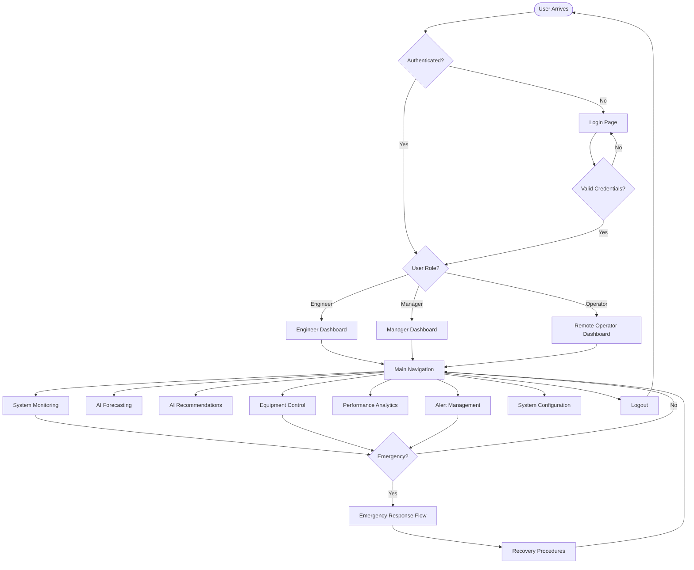

### 2.2 Navigation Hierarchy

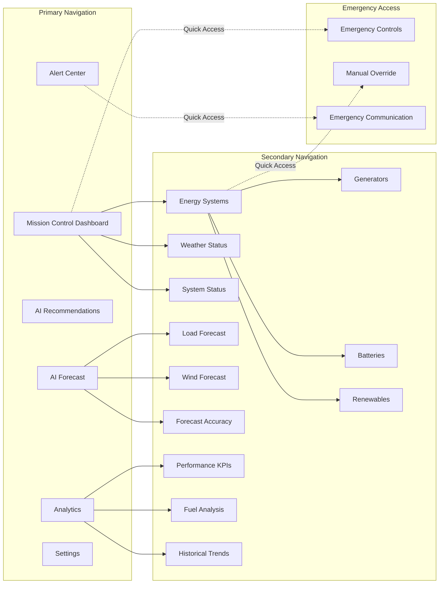

---

## 3. Authentication Flow

### 3.1 User Login Process

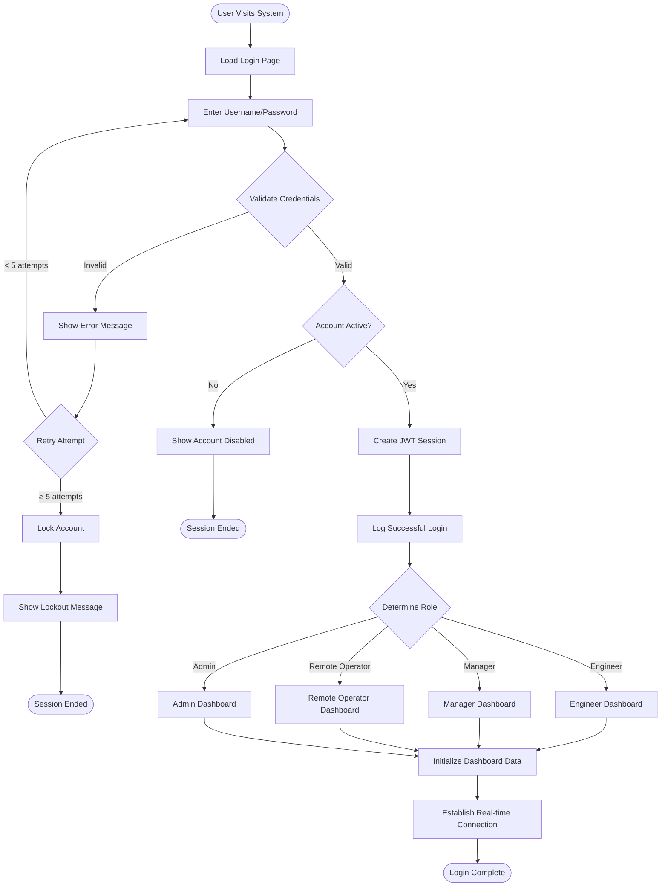

### 3.2 Session Management

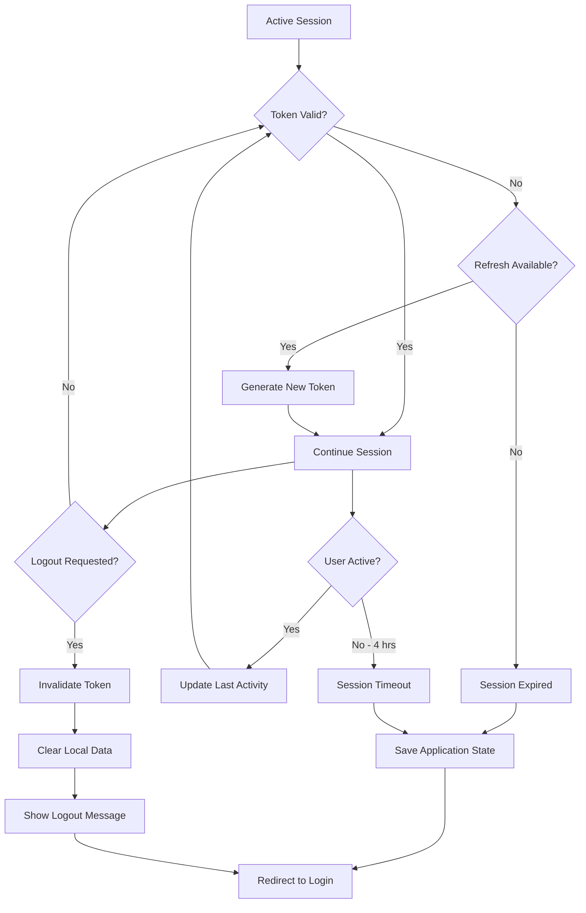

---

## 4. Dashboard Flow

### 4.1 Mission Control Dashboard Navigation

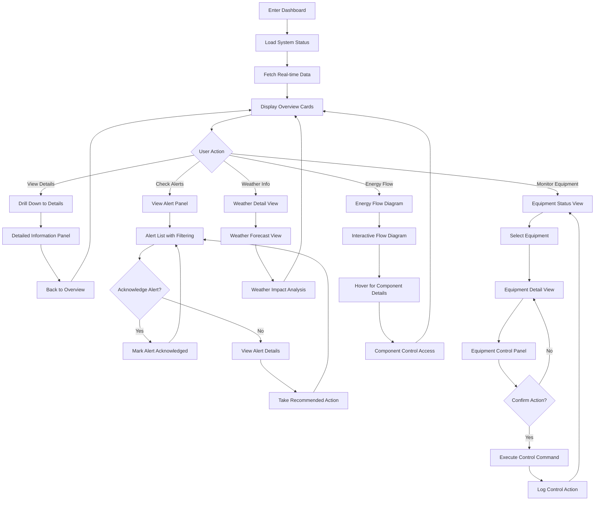

### 4.2 Real-time Data Updates

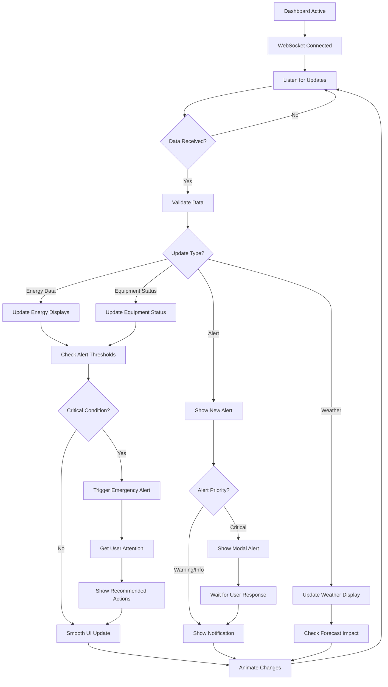

---

## 5. Weather Flow

### 5.1 Weather Information Access

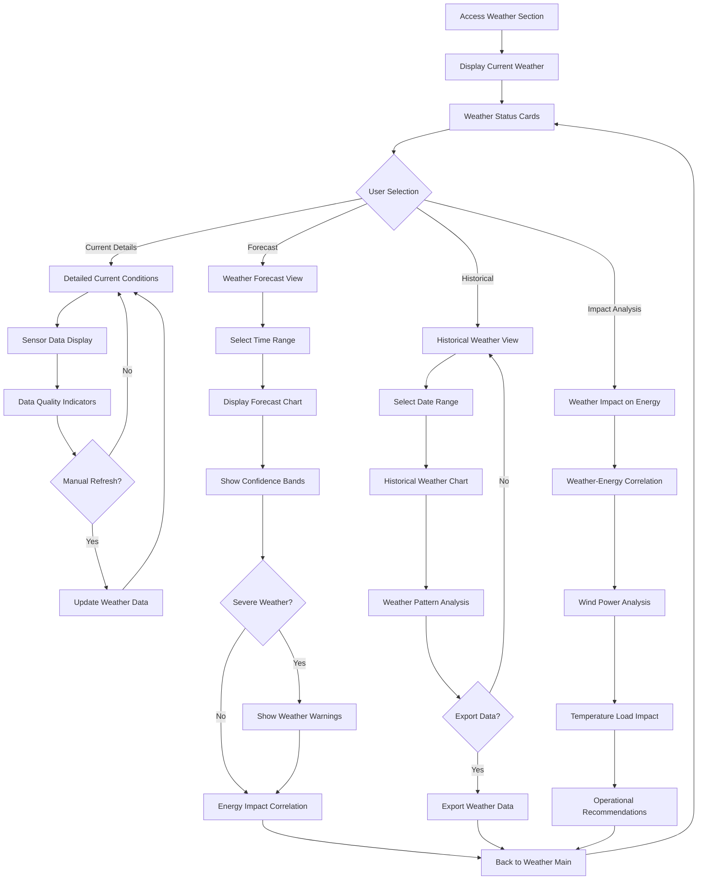

---

## 6. Forecast Flow

### 6.1 AI Forecasting Workflow

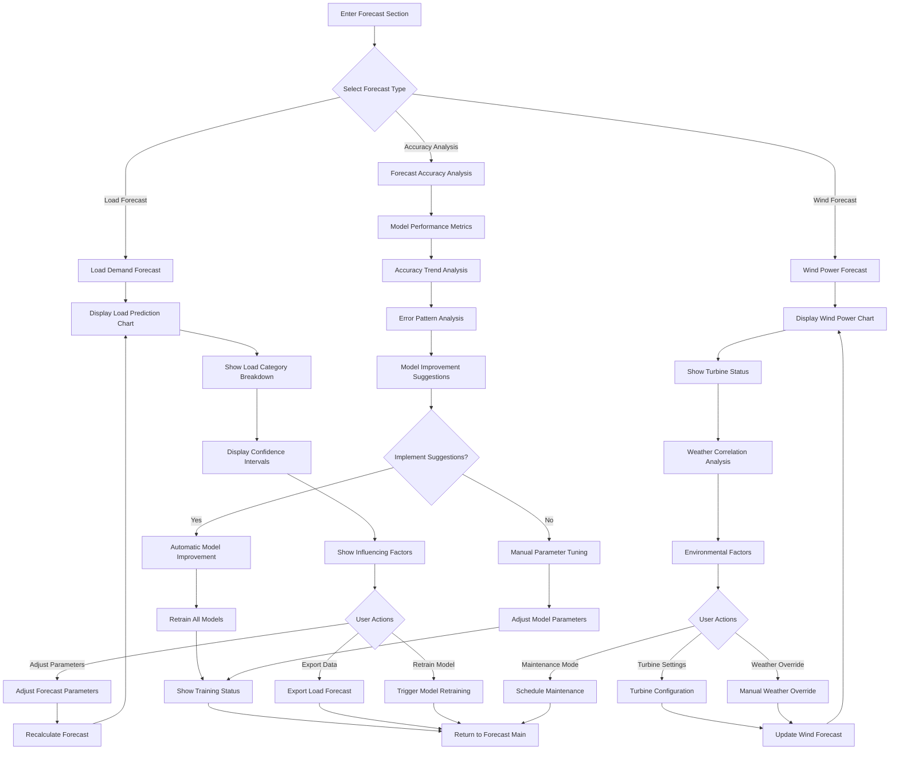
---

## 7. AI Recommendation Flow

### 7.1 Recommendation Review and Implementation

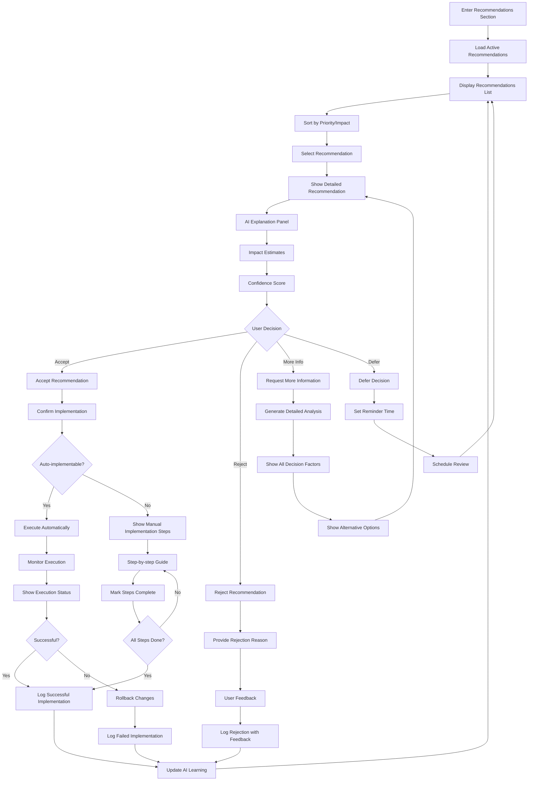

### 7.2 Recommendation Generation Process

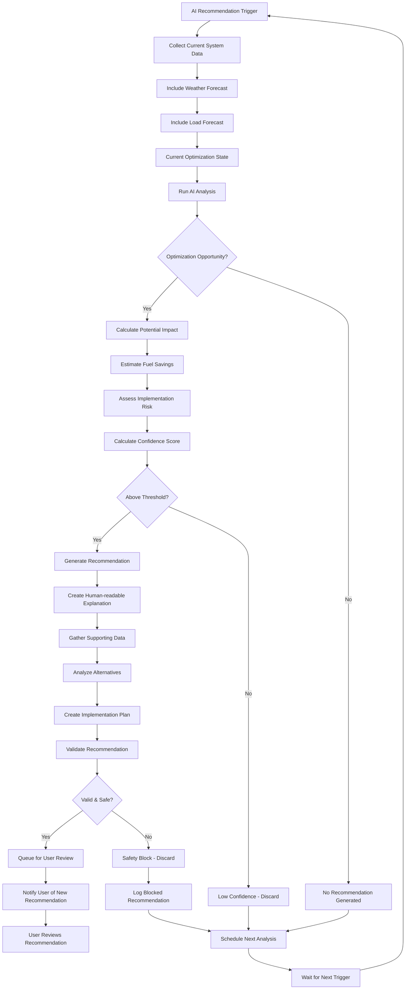

---

## 8. Optimization Flow

### 8.1 Energy Optimization Workflow

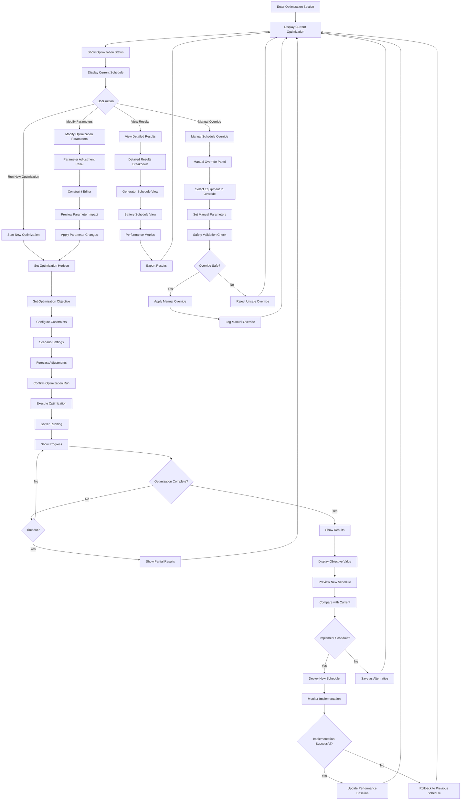

---

## 9. Alert Flow

### 9.1 Alert Management Workflow

```mermaid
graph TD
    ALERT_ENTRY[Enter Alert Center] --> LOAD_ALERTS[Load Active Alerts]
    LOAD_ALERTS --> FILTER_ALERTS[Apply Default Filters]
    FILTER_ALERTS --> ALERT_LIST[Display Alert List]
    
    ALERT_LIST --> SORT{Sort Alerts}
    SORT -->|By Severity| SEVERITY_SORT[Critical → Warning → Info]
    SORT -->|By Time| TIME_SORT[Most Recent First]
    SORT -->|By Equipment| EQUIPMENT_SORT[Group by Equipment]
    
    SEVERITY_SORT --> DISPLAY_SORTED[Display Sorted Alerts]
    TIME_SORT --> DISPLAY_SORTED
    EQUIPMENT_SORT --> DISPLAY_SORTED
    
    DISPLAY_SORTED --> USER_SELECT{User Selects Alert}
    
    USER_SELECT -->|View Details| ALERT_DETAIL[Alert Detail View]
    USER_SELECT -->|Acknowledge| QUICK_ACK[Quick Acknowledge]
    USER_SELECT -->|Filter/Search| FILTER_OPTIONS[Filter/Search Options]
    USER_SELECT -->|Bulk Actions| BULK_OPERATIONS[Bulk Operations Panel]
    
    ALERT_DETAIL --> ALERT_INFO[Alert Information Panel]
    ALERT_INFO --> EQUIPMENT_CONTEXT[Equipment Context]
    EQUIPMENT_CONTEXT --> RECOMMENDED_ACTIONS[Recommended Actions]
    RECOMMENDED_ACTIONS --> HISTORICAL_CONTEXT[Similar Historical Events]
    
    HISTORICAL_CONTEXT --> DETAIL_ACTIONS{Available Actions}
    
    DETAIL_ACTIONS -->|Acknowledge| ACK_WITH_NOTE[Acknowledge with Note]
    DETAIL_ACTIONS -->|Take Action| IMPLEMENT_ACTION[Implement Recommended Action]
    DETAIL_ACTIONS -->|Escalate| ESCALATE_ALERT[Escalate Alert]
    DETAIL_ACTIONS -->|Resolve| RESOLVE_ALERT[Mark as Resolved]
    
    ACK_WITH_NOTE --> NOTE_ENTRY[Enter Acknowledgment Note]
    NOTE_ENTRY --> LOG_ACK[Log Acknowledgment]
    LOG_ACK --> UPDATE_STATUS[Update Alert Status]
    
    IMPLEMENT_ACTION --> ACTION_SELECTION[Select Action to Implement]
    ACTION_SELECTION --> CONFIRM_ACTION[Confirm Action]
    CONFIRM_ACTION --> EXECUTE_ACTION[Execute Action]
    EXECUTE_ACTION --> MONITOR_ACTION[Monitor Action Result]
    MONITOR_ACTION --> ACTION_SUCCESS{Action Successful?}
    
    ACTION_SUCCESS -->|Yes| AUTO_RESOLVE[Auto-resolve Alert]
    ACTION_SUCCESS -->|No| ACTION_FAILED[Log Failed Action]
    
    ESCALATE_ALERT --> ESCALATION_LEVEL[Select Escalation Level]
    ESCALATION_LEVEL --> ESCALATION_CONTACT[Choose Contact]
    ESCALATION_CONTACT --> SEND_ESCALATION[Send Escalation]
    SEND_ESCALATION --> LOG_ESCALATION[Log Escalation]
    
    RESOLVE_ALERT --> RESOLUTION_NOTE[Enter Resolution Note]
    RESOLUTION_NOTE --> ROOT_CAUSE[Document Root Cause]
    ROOT_CAUSE --> PREVENTIVE_ACTION[Document Preventive Actions]
    PREVENTIVE_ACTION --> MARK_RESOLVED[Mark Alert as Resolved]
    
    QUICK_ACK --> SIMPLE_ACK[Simple Acknowledgment]
    SIMPLE_ACK --> UPDATE_STATUS
    
    FILTER_OPTIONS --> SEVERITY_FILTER[Severity Filter]
    SEVERITY_FILTER --> TIME_FILTER[Time Range Filter]
    TIME_FILTER --> EQUIPMENT_FILTER[Equipment Filter]
    EQUIPMENT_FILTER --> APPLY_FILTERS[Apply Filters]
    APPLY_FILTERS --> FILTERED_LIST[Show Filtered Results]
    FILTERED_LIST --> ALERT_LIST
    
    BULK_OPERATIONS --> SELECT_MULTIPLE[Select Multiple Alerts]
    SELECT_MULTIPLE --> BULK_ACTION{Bulk Action Type}
    
    BULK_ACTION -->|Acknowledge All| BULK_ACK[Bulk Acknowledge]
    BULK_ACTION -->|Export| BULK_EXPORT[Export Selected Alerts]
    BULK_ACTION -->|Delete| BULK_DELETE[Bulk Delete (Info only)]
    
    BULK_ACK --> CONFIRM_BULK[Confirm Bulk Operation]
    CONFIRM_BULK --> EXECUTE_BULK[Execute Bulk Action]
    EXECUTE_BULK --> ALERT_LIST
    
    UPDATE_STATUS --> ALERT_LIST
    AUTO_RESOLVE --> ALERT_LIST
    ACTION_FAILED --> ALERT_LIST
    LOG_ESCALATION --> ALERT_LIST
    MARK_RESOLVED --> ALERT_LIST
    BULK_EXPORT --> ALERT_LIST
    BULK_DELETE --> ALERT_LIST
```

### 9.2 Real-time Alert Handling

```mermaid
graph TD
    NEW_ALERT[New Alert Generated] --> CLASSIFY[Classify Alert Severity]
    CLASSIFY --> SEVERITY{Alert Severity}
    
    SEVERITY -->|Critical| CRITICAL_PATH[Critical Alert Path]
    SEVERITY -->|Warning| WARNING_PATH[Warning Alert Path]
    SEVERITY -->|Info| INFO_PATH[Info Alert Path]
    
    CRITICAL_PATH --> IMMEDIATE_DISPLAY[Immediate Modal Display]
    IMMEDIATE_DISPLAY --> AUDIO_ALERT[Audio Alert (if enabled)]
    AUDIO_ALERT --> BLOCK_INTERACTION[Block Other Interactions]
    BLOCK_INTERACTION --> REQUIRE_ACK[Require Acknowledgment]
    
    WARNING_PATH --> NOTIFICATION_BANNER[Notification Banner]
    NOTIFICATION_BANNER --> UPDATE_COUNTER[Update Alert Counter]
    UPDATE_COUNTER --> DASHBOARD_HIGHLIGHT[Highlight Affected Systems]
    
    INFO_PATH --> SILENT_NOTIFICATION[Silent Notification]
    SILENT_NOTIFICATION --> UPDATE_COUNTER
    
    REQUIRE_ACK --> USER_RESPONSE{User Responds?}
    USER_RESPONSE -->|Yes| PROCESS_RESPONSE[Process User Response]
    USER_RESPONSE -->|No - 2 min| ESCALATE_UNACK[Escalate Unacknowledged]
    
    ESCALATE_UNACK --> SECONDARY_CONTACTS[Notify Secondary Contacts]
    SECONDARY_CONTACTS --> CONTINUE_ALERTS[Continue Alert Display]
    CONTINUE_ALERTS --> USER_RESPONSE
    
    PROCESS_RESPONSE --> RESPONSE_TYPE{Response Type}
    RESPONSE_TYPE -->|Acknowledge| LOG_ACK_TIME[Log Acknowledgment Time]
    RESPONSE_TYPE -->|Take Action| GUIDED_ACTION[Guided Action Flow]
    RESPONSE_TYPE -->|Manual Override| OVERRIDE_SAFETY[Safety Override Flow]
    
    GUIDED_ACTION --> ACTION_STEPS[Display Action Steps]
    ACTION_STEPS --> STEP_COMPLETION[Track Step Completion]
    STEP_COMPLETION --> ALL_COMPLETE{All Steps Done?}
    ALL_COMPLETE -->|Yes| SUCCESS_RESOLUTION[Successful Resolution]
    ALL_COMPLETE -->|No| NEXT_STEP[Continue to Next Step]
    NEXT_STEP --> ACTION_STEPS
    
    OVERRIDE_SAFETY --> SAFETY_WARNING[Display Safety Warning]
    SAFETY_WARNING --> CONFIRM_OVERRIDE[Confirm Override Decision]
    CONFIRM_OVERRIDE --> OVERRIDE_GRANTED{Override Confirmed?}
    OVERRIDE_GRANTED -->|Yes| LOG_OVERRIDE_ACTION[Log Override Action]
    OVERRIDE_GRANTED -->|No| RETURN_GUIDED[Return to Guided Actions]
    
    LOG_ACK_TIME --> CONTINUE_MONITORING[Continue System Monitoring]
    SUCCESS_RESOLUTION --> AUTO_CLOSE[Auto-close Alert]
    LOG_OVERRIDE_ACTION --> ENHANCED_MONITORING[Enhanced Safety Monitoring]
    
    CONTINUE_MONITORING --> RESOLUTION_CHECK[Check for Auto-resolution]
    RESOLUTION_CHECK --> RESOLVED{Condition Resolved?}
    RESOLVED -->|Yes| AUTO_CLOSE
    RESOLVED -->|No| CONTINUE_MONITORING
    
    AUTO_CLOSE --> UPDATE_METRICS[Update Alert Metrics]
    UPDATE_METRICS --> LEARNING_UPDATE[Update AI Learning]
    LEARNING_UPDATE --> ALERT_COMPLETE[Alert Handling Complete]
    
    ENHANCED_MONITORING --> SAFETY_TIMEOUT[Safety Override Timeout]
    SAFETY_TIMEOUT --> RESTORE_AUTOMATION[Restore Automated Safety]
    RESTORE_AUTOMATION --> CONTINUE_MONITORING
```

---

## 10. Scenario Simulation Flow

### 10.1 Failure Scenario Testing

```mermaid
graph TD
    SIM_ENTRY[Enter Simulation Mode] --> SIM_WARNING[Simulation Safety Warning]
    SIM_WARNING --> CONFIRM_SIM[Confirm Simulation Mode]
    CONFIRM_SIM --> SIM_TYPES[Select Simulation Type]
    
    SIM_TYPES --> SCENARIO{Scenario Type}
    
    SCENARIO -->|Equipment Failure| EQUIPMENT_SIM[Equipment Failure Simulation]
    SCENARIO -->|Weather Event| WEATHER_SIM[Severe Weather Simulation]
    SCENARIO -->|Load Spike| LOAD_SIM[Load Spike Simulation]
    SCENARIO -->|Communication Loss| COMM_SIM[Communication Failure Simulation]
    
    EQUIPMENT_SIM --> SELECT_EQUIPMENT[Select Equipment to Fail]
    SELECT_EQUIPMENT --> FAILURE_TYPE[Select Failure Type]
    FAILURE_TYPE --> FAILURE_PARAMS[Set Failure Parameters]
    FAILURE_PARAMS --> DURATION[Set Simulation Duration]
    
    WEATHER_SIM --> WEATHER_TYPE[Select Weather Event Type]
    WEATHER_TYPE --> WEATHER_INTENSITY[Set Event Intensity]
    WEATHER_INTENSITY --> WEATHER_DURATION[Set Event Duration]
    WEATHER_DURATION --> DURATION
    
    LOAD_SIM --> LOAD_INCREASE[Set Load Increase Amount]
    LOAD_INCREASE --> LOAD_PATTERN[Select Load Pattern]
    LOAD_PATTERN --> LOAD_DURATION[Set Load Duration]
    LOAD_DURATION --> DURATION
    
    COMM_SIM --> COMM_TYPE[Select Communication Type]
    COMM_TYPE --> OUTAGE_SCOPE[Set Outage Scope]
    OUTAGE_SCOPE --> COMM_DURATION[Set Outage Duration]
    COMM_DURATION --> DURATION
    
    DURATION --> SAFETY_CHECK[Final Safety Check]
    SAFETY_CHECK --> SAFE_TO_RUN{Safe to Execute?}
    
    SAFE_TO_RUN -->|Yes| START_SIM[Start Simulation]
    SAFE_TO_RUN -->|No| SIM_BLOCKED[Simulation Blocked]
    SIM_BLOCKED --> MODIFY_PARAMS[Modify Parameters]
    MODIFY_PARAMS --> SAFETY_CHECK
    
    START_SIM --> INJECT_FAILURE[Inject Failure Event]
    INJECT_FAILURE --> MONITOR_RESPONSE[Monitor System Response]
    MONITOR_RESPONSE --> AI_DETECTION[AI Detection Response]
    AI_DETECTION --> AUTO_ACTIONS[Automatic Actions Triggered]
    
    AUTO_ACTIONS --> RESPONSE_LOG[Log System Responses]
    RESPONSE_LOG --> USER_ACTIONS[Present User Action Options]
    USER_ACTIONS --> USER_CHOICE{User Choice}
    
    USER_CHOICE -->|Follow AI| FOLLOW_AI[Follow AI Recommendations]
    USER_CHOICE -->|Manual Control| MANUAL_CONTROL[Take Manual Control]
    USER_CHOICE -->|Observe Only| OBSERVE_MODE[Observation Mode]
    
    FOLLOW_AI --> IMPLEMENT_AI[Implement AI Actions]
    IMPLEMENT_AI --> TRACK_RESULTS[Track Implementation Results]
    
    MANUAL_CONTROL --> MANUAL_ACTIONS[Manual Action Panel]
    MANUAL_ACTIONS --> SAFETY_OVERRIDE[Safety Override Options]
    SAFETY_OVERRIDE --> EXECUTE_MANUAL[Execute Manual Actions]
    EXECUTE_MANUAL --> TRACK_RESULTS
    
    OBSERVE_MODE --> CONTINUE_MONITORING[Continue Monitoring]
    CONTINUE_MONITORING --> TRACK_RESULTS
    
    TRACK_RESULTS --> TIME_CHECK{Simulation Time Up?}
    TIME_CHECK -->|No| ONGOING_MONITORING[Ongoing Performance Monitoring]
    ONGOING_MONITORING --> MONITOR_RESPONSE
    
    TIME_CHECK -->|Yes| END_SIM[End Simulation]
    END_SIM --> RESTORE_NORMAL[Restore Normal Operations]
    RESTORE_NORMAL --> GENERATE_REPORT[Generate Simulation Report]
    
    GENERATE_REPORT --> PERFORMANCE_ANALYSIS[Performance Analysis]
    PERFORMANCE_ANALYSIS --> LESSONS_LEARNED[Lessons Learned]
    LESSONS_LEARNED --> RECOMMENDATIONS[Improvement Recommendations]
    RECOMMENDATIONS --> SAVE_RESULTS[Save Simulation Results]
    
    SAVE_RESULTS --> SHARE_RESULTS[Share Results Options]
    SHARE_RESULTS --> SIM_COMPLETE[Simulation Complete]
    SIM_COMPLETE --> EXIT_SIM[Exit Simulation Mode]
```

---

## 11. Daily Report Flow

### 11.1 Automated Daily Report Generation

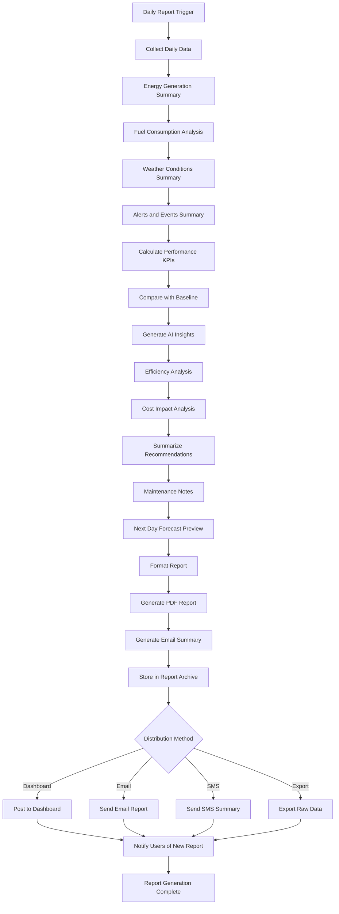

### 11.2 Manual Report Access and Customization

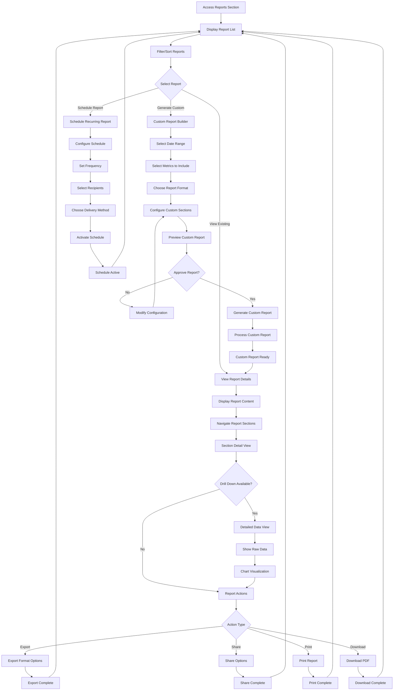

---

*This User Flow Document provides comprehensive workflow definitions for all POLAR-EMS user interactions, ensuring efficient and intuitive system operation while maintaining safety and reliability in polar research station environments.*